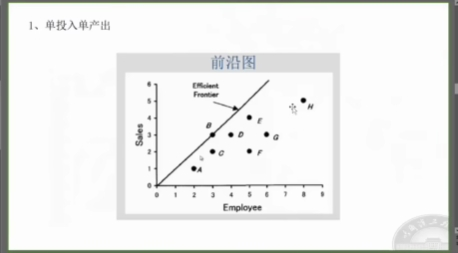
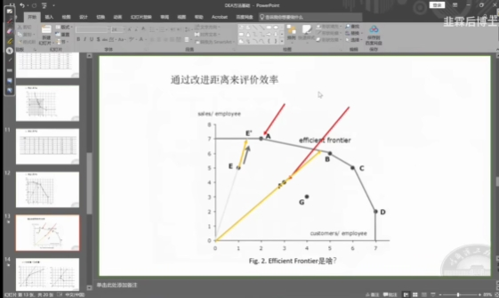

dea(数据包络分析法)
deap

多投入多产出问题

DMU数量：n >= max(p*q, 3(p+q))   

p: 投入指标
q: 产出指标

指标问题：
p: 不要0和负数

回归分析解释变量相关性要低，dea中不需要做相关性检验，tobit回归需要

效率前沿将数据包裹起来，而回归模型是穿过数据

相对评价，类似排序

效率或相对效率计算

效率： 投入，产出比

DMU(决策单元)：公司/企业

同类型DMU才能比较

效率前沿

## 通过"改进"计算无效效率的大小（减少投入）

样本到30 左右前沿面会比较准确

规模报酬递增
规模报酬递减
规模报错不变

弱有效/强有效

crs 综合技术效率  te
vrs 纯技术效率 pte
scale 规模效率 se  

 = pte * se

# 参考

中国31个省市科技创新效率及投入冗余比较  郭淑芬 张俊
我国财产保险公司融资效率的dea比较分析   初立苹

malmqiust指数  （生成率指数  效率值得变化率   ec  tc 技术进步指数）
sbm模型
超效率模型(径向、非径向)

避免做回归是效率多为1的情况