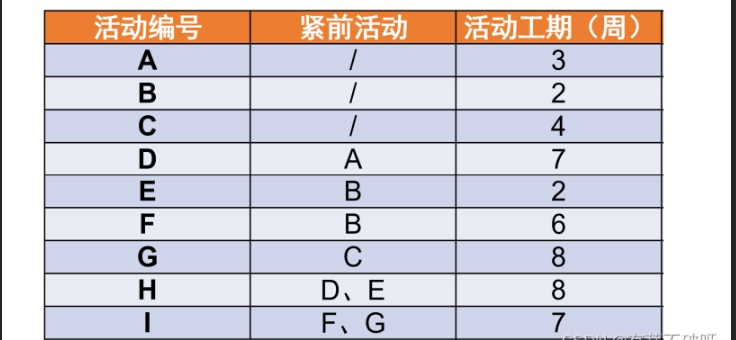
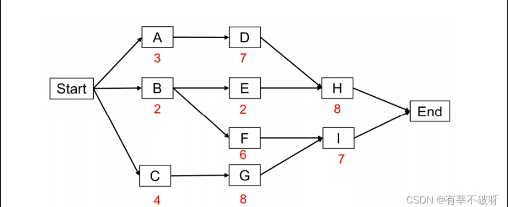
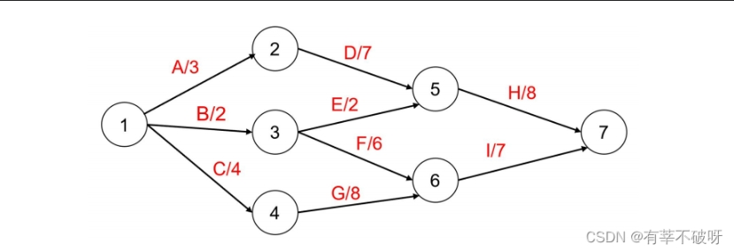
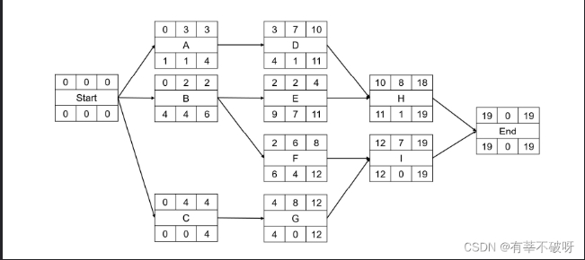
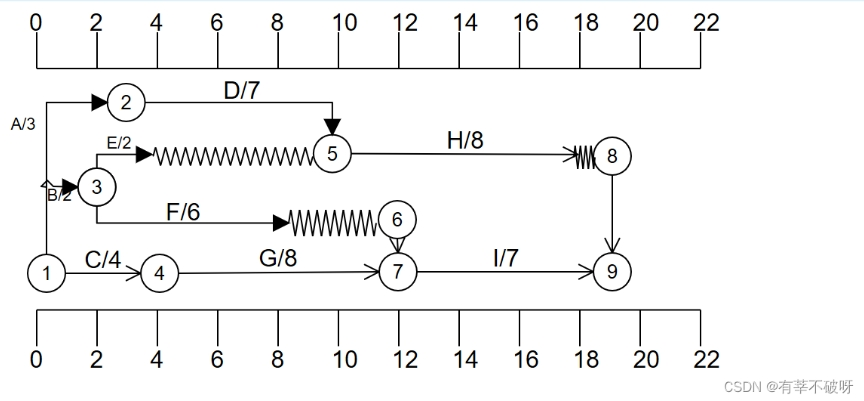
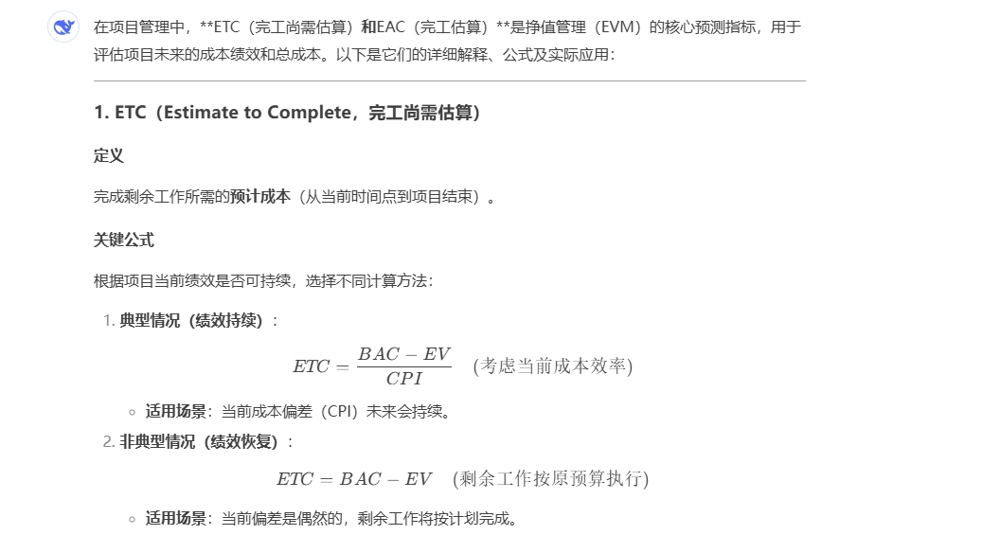
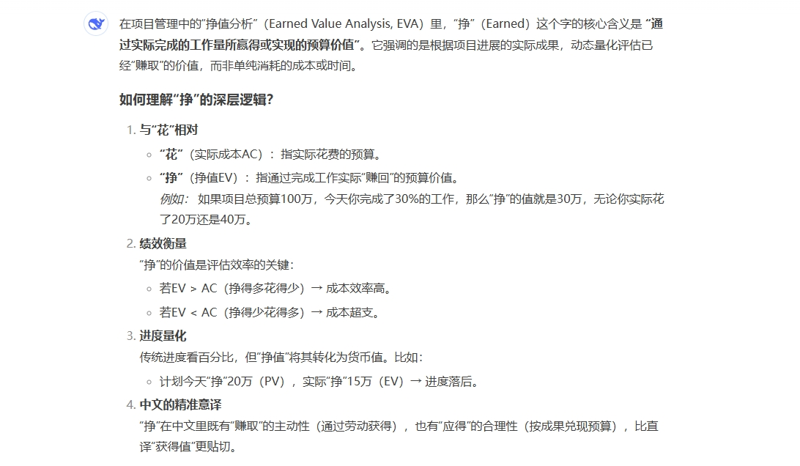
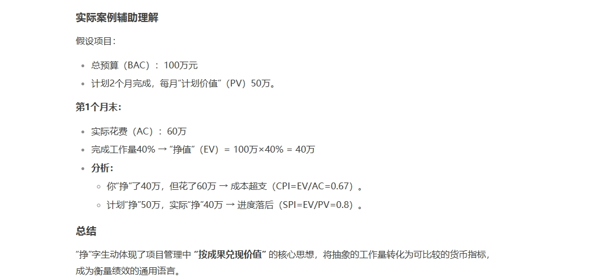

<!-- <Catalog/> -->

## 项目范围管理

项目范围管理： 确保项目做且只做所需的全部工作，以完成项目。
产品范围：指某项产品、服务或成果所具有的特征和功能
项目范围：包括产品范围，是为交付具有规定特性与功能的产品、服务或成果而必须完成的工作

### 规划范围管理
章程计划、组织事业
范围管理计划、需求管理计划

**范围管理计划内容：**
* 制定项目范围说明书
* 根据详细项目范围说明书创建WBS
* 确定如何审批和维护范围基准
* 正式验收已完成的项目可交付成果

**需求管理计划内容：**
* 如何规划、跟踪和报告各种需求活动
* 配置管理活动
* 需求优先级排序
* 测量指标及使用这些指标的理由
* 反应那些需求属性将被列入跟踪矩阵

### 收集需求

协议章程、立项管理文件、文件计划、组织事业
需求文件、需求跟踪矩阵
**工具技术**
* 决策
* 原型法
* 专家判断
* 数据分析
* 数据收集
    * 头脑风暴-用来产生和收集对项目需求和产品需求的多种创意的技术
    * 访谈-通过与干系人直接交谈，来获取信息的正式或非正式的方法
    * 焦点小组-召集预定的干系人和主题专家，了解他们对所讨论的产品、服务或成果的期望和态度
    * 问卷调差-设计一系列书面问题，向众多受访者快速收集信息
    * 标杆对照-与其他科比组织的实践进行比较，可比组织可以是内部的，也可以是外部的
* 数据表现
    * 亲和图-对大量创意进行分组
    * 思维导图-把从头脑风暴中获得的创意整合成一张图
    * 名义小组-用于促进头脑风暴的技术，通过投票排列最有用的创意，以便进一步开展头脑风暴或优先级排序
    * 观察与交谈-直接察看个人在各自的环境中如何执行工作和实施流程
    * 引导
* 系统交互图
* 人际关系与团队技能

为实现目标而确定、记录并管理干系人的需要和需求的过程
**作用:** 为定义产品范围和项目范围奠定基础
**仅开展一次或仅在项目的预定义点开展**

**需求文件内容**
* 业务需求
* 干系人需求
* 解决方案需求
* 过渡和就绪需求
* 项目需求
* 质量需求

**需求跟踪矩阵内容**
* 业务需要、机会、目的和目标
* 项目目标
* 项目范围和wbs可交付成果
* 产品设计
* 产品开发
* 测试策略和测试场景
* 高层级需求到详细需求

### 定义范围

章程计划、组织事业
项目范围说明书

工具技术：
* 决策
* 专家判断
* 产品分析
* 数据分析
* 人际关系与团队技能

是制定项目和产品详细描述的过程
作用： 是描述产品、服务或成果的边界和验收标准
**多次反复开展**

### 创建wbs
文件计划、组织事业
范围基准
工具技术：
* 分解
* 专家判断

把项目可交付成果和项目工作分解成较小、更易于管理的组件的过程
作用： 是为所交付的内容提供架构
**仅开展一次**
WBS分解活动：
* 识别和分析可交付成果及相关工作
* 确定wbs的结构和编排方法
* 自上而下逐层细化分解
* 为wbs组成部分制定和分配标识编码
* 核实可交付成果分解的程度是否恰当

wbs注意事项：
* wbs必须是面向可交付成果
* wbs必须符合项目的范围（100%原则）
* wbs的底层应该支持计划和控制
* wbs中的元素必须有人负责，而且只有一个人负责
* wbs应控制4-6层，每个级别的wbs级的一个元素分为4-7个新元素，同一级元素大小应该相似。一个工作单元只能从属于某个上层单元，避免交叉从属
* wbs应包括项目管理工作,也要包含分包出去的工作
* wbs编制需要所有（主要）项目干系人参与
* wbs并非是一成不变的

范围基准内容：
* 批准的范围说明书
* WBS
* WBS词典

项目范围说明书： 包括对项目范围、主要可交付成果、假设条件和制约因素的描述
wbs: 是对项目团队为实现项目目标、创建所需可交付成果而需要实施的全部工作范围的层级分级
工作包： wbs的最底层是带有独特标识号的工作包。这些标识号为成本、进度和资源信息的逐层汇总提供了层级结构，及账户编码。每个工作包都是控制账户的一部分，而控制账户则是一个管理控制点。控制账户
包含两个或多个工作包，每个工作包只和一个工作账户关联
规划包： 是一种低于控制账户而高于工作包的工作分解结构组件，工作内容已知，但详细的进度活动未知，一个控制账户可以包含一个或多个规划包
wbs词典：是针对wbs中的每个组件，详细描述可交付成果、活动和进度信息的文件

### 确认范围
核实的可交付成果、工作绩效数据、文件计划、组织事业
验收的可交付成果、变更请求、工作绩效信息、文件计划更新

正式验收已完成的项目可交付成果的过程
* 使验收过程具有客观性
* 通过确认每个可交付成果来提高最终产品、服务或成果获得验收的可能行

**根据需要在整个项目期间定期开展，应贯穿项目始终**

在确认范围前，项目团队需要先进行质量控制工作
确认范围关注可交付成果的验收，控制质量关注可交付成果的正确行及是否满足质量要求。
控制质量过程通常先于确认范围，也可同时进行

确认范围步骤：
* 确定需要进行范围确认的时间
* 识别范围确认需要哪些投入
* 确定范围正式被接收的标准和要素
* 确定范围确认会议的组织步骤
* 组织范围确认会议

验收的可交付成果： 符合验收标准的可交付成果应该由客户或发起人正式签字批准

### 控制范围
工作绩效数据、文件计划、组织
变更请求、工作绩效信息、文件计划更新

监督项目和产品的范围状态，管理范围基准变更的过程
在整个项目期间保持对范围基准的维护

**整个项目期间开展**

偏差分析： 将基准与实际结果进行比较，以确定偏差是否处于临界区间内或是否有必要采取纠正或预防措施
趋势分析： 审查项目绩效随时间的变化情况，以判断绩效是正在改善还是正在恶化

## 项目进度管理

### 规划进度管理

章程计划、组织事业
进度管理计划

是为规划、编制、管理、执行和控制项目进度而制定政策、程序和文档的过程
为如何再整个项目期间管理项目进度提供指南和方向

**仅开展一次**

进度管理计划内容：
* 项目进度模型
* 进度计划的发布和迭代长度
* 准确度
* 计量单位
* 工作分级结构（WBS）
* 项目进度模型维护
* 控制临界值
* 绩效测量规则
* 报告格式

### 定义活动
计划、组织事业
活动清单、活动属性、里程碑清单

是识别和记录为完成项目可交付成果而须采取的具体行动的过程
将工作包分解为进度活动，作为对项目工作进行进度估算、规划、执行、监督和控制的基础

**整个项目期间开展**

滚动式规划：
    是一种迭代式的规划技术，详细规划近期要完成的工作，再较高层级上粗略规划远期工作。是一种渐进式的规划方式，适用于工作包、规划包

活动清单：
    包含项目所需的进展活动
活动属性：
    指每项活动所具有的多重属性，用来扩充对活动的描述，活动属性随着项目进展情况演进并更新
里程碑清单：
    项目中的重要时点或事件，**里程碑的持续时间为0**

### 排列活动顺序
文件计划、组织事业
项目进度网络图

* 箭线图
* 紧前关系绘图法
* 提前量和滞后量
* 确定和整合依赖关系

识别和记录项目活动之间关系的过程
定义工作之间的逻辑顺序，以便再既定的所有项目制约因素下获得最高的效率

**整个项目期间开展**

紧前关系绘图、PDM、前导图、单代号网络图、活动节点图

活动之间存在4种依赖关系：
* F-S（结束开始）
* F-F（结束结束）
* S-S（开始开始）
* S-F(开始结束)

六标时网络图

箭线图、ADM、双代号网络图、活动箭线图

提前量与滞后量
    提前量相对于紧前活动，紧后活动可以提前的时间量，一般为负值
    滞后量先对于紧前活动，紧后活动可以推迟的时间量，一般为正值

单代号网络图
除了首尾，每个活动编号一个方框，再用剪线根据紧前活动关系把每个方框连起来，最后再在每个活动方框标上活动时间

2、双代号网络图

活动方框变成了步骤圆圈，每条箭线变成了活动编号，画图关键，把紧前关系放在箭线上，例如H、I活动的线是分别来自于DE、FG；最后在每条箭线上标注活动编号与它的活动时间

3、6时标网络图（7格图）

这个就是把单代号图中的每个方格换成7格图，分清楚7格图中需要填写的6个数据即可，先填写活动历时，确定好关键路径和总时间后然后采用倒推的方式，填写另外5个数。

4、双代号时标网络图

 是把双代号图加上上下两个时间刻度，围绕关键路径将其他活动根据时间情况进行画图，非关键路径上的活动时间差用波浪号连接，最后在活动箭线上标注活动名称及活动历时

### 估算活动持续时间

文件计划、组织事业
估算依据、持续时间估算

类比估算、参数估算、三点估算、自上而下估算

根据资源估算的结果，估算完成单项活动所需工作时段数的过程
确定完成每个活动所需花费的时间量

**整个项目期间开展**
应该由项目团队种最熟悉具体活动的个人或小组提供持续时间估算所需的各种输入，对持续时间的估算也应该根据呼入数据的数量和质量进行渐进明细。随着数据越来越详细，越来越准确，持续时间估算的准确性和质量也会越来越高

* 类比估算
    使用相似活动或项目的历史数据来估算当前活动或项目的持续时间或成本，是一种粗略估算，成本较低、耗时较少、但准确性也较低。可以针对整个项目或项目中的某个部分进行，也可与其他估算方法结合

* 参数估算
    基于历史数据和项目参数，使用某种算法来计算成本或持续时间的技术。准确性取决于参数模型的成熟度和基础数据的可靠性
* 三点估算
    当历史数据不充分时，通过考虑估算中的不确定性和风险，可以提高活动持续时间估算的准确性，
    **三角分布=（乐观+最可能+悲观）/3**
    **β分布=（乐观+4*最可能+悲观）/6**

* 自上而下估算
    从下到上逐层汇总wbs组成部分的估算而得到项目估算

#### 储备分析
* 应急储备

与**已知-未知**风险相关，用来应对已经接收的已识别风险，

* 管理储备
与**未知-未知**风险相关，**它不包括在进度基准中，但属于项目总持续时间的一部分**，依据合同条款，使用管理储备可能需要变更进度基准

### 制订项目进度计划
协议、文件计划、组织事业
进度基准、进度数据、项目日历、项目进度计划

工具：
* 进度压缩
* 资源优化
    根据资源供需情况来调整进度模型。
    资源平衡： 为了在资源需求与资源供给之间取得平衡，根据资源制约因素对开始日期和完成日期进行调整。**往往导致关键路径改变，通常是延长**
    资源平滑：
        对进度模型中的活动进行调整，从而使项目资源需求不超过预定的资源限制。**资源平滑不会改变项目的关键路径，完成工期也不会延迟，活动只在其自由浮动时间和总浮动时间内延迟，但资源平滑可能无法实现所有的资源优化**
* 关键路径法
    项目中时间最长的活动顺序，决定着可能的项目最短工期。**最长路径的总浮动时间通常为0**
    总浮动时间： 在任一网络路径上，进度活动可以从最早开始日期推迟或拖延的时间，而不至于延误项目完成日期或违反进度制约因素，就是总浮动时间。
    计算方式： **本活动的最迟完成时间-本活动的最早完成时间（最迟开始时间-最早开始时间）**
    自由浮动时间：指在不延误任何紧后活动的最早开始日期或不违反进度制约因素的前提下，某进度活动可以推迟的时间量，
    **紧后活动最早开始时间的最小值-本活动最早完成时间**
* 计划评审技术
* 提前量与滞后量
* 敏捷或适应型发布规划

分析活动顺序、持续时间、资源需求和进度制约因素，创建进度模型，从而落实项目执行和监控的过程
是为完成项目活动而制定具有计划日期的进度模型

**整个项目期间开展**
是一个反复进行的过程

项目日历：
    规定可以开展进度活动的可用工作日和工作班次，它把可以用于开展进度活动的时间段（按天或更小的时间单位）与不可用时间段区分开来

### 控制进度

文件计划、工作绩效数据、组织过程资产
进度预测、变更请求、工作绩效信息、文件计划更新

工具：
* 关键路径法
* 进度压缩
* 资源优化
* 提前量与滞后量

监督项目状态，以更新项目进度和管理进度基准变更的过程
在整个项目期间保持对进度基准的维护

**整个项目期间开展**

进度基准的**任何变更**都必须经过实施整体变更控制过程的审批

## 项目成本管理

为了项目在批准的预算内完成，对成本进行规划、估算、预算、融资、筹资、管理和控制的过程

成本失控的原因：
* 对工程项目认识不足
* 组织制度不健全
* 方法问题
* 技术的制约
* 需求管理不当

成本类型
* 可变成本
    随着生产量、工作或时间而变的成本
* 固定成本
    不随生产量、工作或时间而变的成本
* 直接成本
    直接可以归属于项目工作的成本，如项目团队差旅费、工资、项目使用的物料及设备使用费
* 间接成本
    税金、额外福利、保卫费
* 机会成本
    做出选择后其中一个最大的损失
* 沉没成本
    指过去的决策已经发生了，不可能由现在或将来的任何决策改变的成本，是一种历史成本

储备分析：
* 应急储备
    包含在成本基准内  已知-未知
* 管理储备
    不包含在成本基准内，但属于项目总预算和资金需求的一部分   未知-未知

### 规划成本管理
章程计划、组织事业
成本管理计划

确定如何估算、预算、管理、监督和控制项目成本的过程
在整个项目期间为如何管理项目成本提供指南和方向

**仅开展一次**
应在项目早期完成对成本管理工作的进行规划

成本管理计划内容：
* 计量单位
* 精确度
* 准确度
* 组织程序链接
* 控制临界值
* 绩效测量规则
* 报告格式

### 估算成本
文件计划、组织事业
估算依据、成本估算

工具： 
* 类比估算
* 参数估算
* 三点估算
* 自下而上估算

是对完成项目工作所需资源成本进行近似估算
确定项目所需的资金

**整个项目期间定期开展**

### 制定预算

协议、可行性研究文件（可行性研究报告、项目评估报告）
成本基准、项目资金需求
工具
* 融资
* 资金限制平衡

汇总所有单个活动或工作包的估算成本，建立一个经批准的成本基准的过程
确定可以依据其来进行监督和控制项目绩效的成本基准

项目预算：包括经批准用于项目的全部资金
成本基准：包括应急储备，不包括管理储备

项目预算=成本基准+管理储备

### 控制成本

资金需求
成本预测

监督项目状态，以更新项目成本和管理成本基准变更的过程
在整个项目期间保持对成本基准的维护

**整个项目期间开展**

只有经过实施整体变更控制过程的批准，才可以增加预算。有效控制成本的关键在于**管理经批准的成本基准**

成本控制的目标
* 对造成成本基准变更的因素施加影响
* 确保所有变更请求都得到及时处理
* 当变更实际发生时，管理这些变更
* 确保成本支出不超过批准的资金限额，既不超出按时段、wbs组件和活动分配的限额，也不超出项目总限额
* 监督成本绩效，找出并分析与成本基准间的偏差
* 对照资金支出，监督工作绩效
* 防止在成本或资源使用报告中出现未经批准的变更
* 像干系人报告所有经批准的变更及其相关成本
* 设法把预期的成本超支控制在可接受的范围内

挣值分析
pv 计划价值
ev 挣值
ac 实际成本
bac 完工预算
etc 完工尚需估算
eac 完工估算
项目总资金（总预算）= bac+ 管理储备

典型（绩效持续）
    etc = (bac-ev) / cpi
非典型（绩效恢复）
    etc = bac-ev

