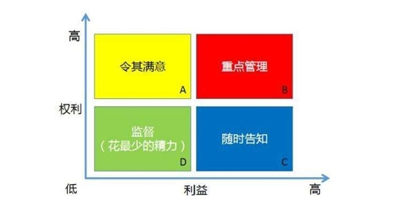

```component VPCard
title: 进度落后成本超支
desc: 用高效人员代替低效人员<br/>加班或者赶工，在防范风险的情况下并行施工<br/>减少活动范围、降低活动要求<br/>通过改进方法或技术提高生成效率<br/>分析成本超支的原因，再找出针对性对策如改进方法、优化方案、提高效率等 
logo: https://mister-hope.com/logo.svg
link: https://mister-hope.com
background: rgba(253, 230, 138, 0.15)
```
```component VPCard
title: 进度落后成本节约
desc: 赶工（例如全体加班方式）加快速度<br/>使用高效资源代替低效资源加快速度<br/>改进方法提高工作效率 
logo: https://mister-hope.com/logo.svg
link: https://mister-hope.com
background: rgba(253, 230, 138, 0.15)
```
```component VPCard
title: 进度提前成本超支
desc: 抽取部分人员以放慢工作进度<br/>采取控制成本措施<br/>项目中区分不同的任务，采取不同的成本及进度措施<br/>必要时调整成本基准<br/>优化施工方案、提高效率、加强质量管理减少返工、加强沟通以降低成本<br/>在确保进度按期完成的基础上，可以降低进度以节约成本<br/>总结项目进度提前的经验，并记录下来,把这经验传播到项目的其他班组，甚至其他项目或未来项目
logo: https://mister-hope.com/logo.svg
link: https://mister-hope.com
background: rgba(253, 230, 138, 0.15)
```
```component VPCard
title: 进度提前成本节约
desc: 抽调部分人员用于其他项目<br/>加强质量监控，密切监控项目<br/>必要时调整计划或基准等方法改进或改变相关计划
logo: https://mister-hope.com/logo.svg
link: https://mister-hope.com
background: rgba(253, 230, 138, 0.15)
```
---
## 其他
```component VPCard
title: 范围说明书
desc: 产品范围描述；项目验收标准；项目除外责任；可交付成果；假设条件；制约因素
logo: https://catpd.cn/svg/903.svg
link: https://mister-hope.com
background: rgba(253, 230, 138, 0.15)
```
```component VPCard
title: 项目建议书
desc: 项目的必要性；项目建设的必要条件；项目的市场预测；项目预期成果的市场预测
logo: https://catpd.cn/svg/903.svg
link: https://mister-hope.com
background: rgba(253, 230, 138, 0.15)
```
```component VPCard
title: 可行性研究
desc: 技术、经济、社会效益、运行环境、其他方面的可行性风析
logo: https://catpd.cn/svg/903.svg
link: https://mister-hope.com
background: rgba(253, 230, 138, 0.15)
```
```component VPCard
title: 变更流程
desc: 变更申请；变更初审；变更方案论证；变更审查；发布通知并实施；实施监控；效果评估；变更收尾
logo: https://catpd.cn/svg/903.svg
link: https://mister-hope.com
background: rgba(253, 230, 138, 0.15)
```

```component VPCard
title: wbs分解步骤
desc: 识别和分析可交付成果及相关工作；确定wbs结构及编排方式；自上而下逐层细化分解；为wbs组件制定和分配标识编码；核实可交付成果的分解程度是否恰当
logo: https://catpd.cn/svg/903.svg
link: https://mister-hope.com
background: rgba(253, 230, 138, 0.15)
```

```component VPCard
title: 缩短活动工期
desc: 赶工，投入更多的资源或增加工作时间，以缩短关键活动的工期；快速跟进，并行施工，以缩短关键路径长度；使用高素质的资源或经验更丰富的人员；减少活动范围或降低活动要求；改进方法或技术，以提高生产效率；加强质量管理，及时发现问题，减少返工，从而缩短工期
logo: https://catpd.cn/svg/903.svg
link: https://mister-hope.com
background: rgba(253, 230, 138, 0.15)
```

```component VPCard
title: 资源平衡
desc: 为了在资源需求与资源供给之间取得平衡，根据资源制约因素对开始日期和完成日期进行调整的一种技术。如果共享资源或关键资源只在特定时间可用而且数量有限，如一个资源在同一时段内被分配至两个或多个活动，就需要进行资源平衡。也可以为保持资源使用量处于均衡水平而进行资源平衡。资源平衡往往导致关键路径改变
logo: https://catpd.cn/svg/903.svg
link: https://mister-hope.com
background: rgba(253, 230, 138, 0.15)
```
```component VPCard
title: 资源平滑
desc: 对进度模型中的活动进行调整，从而使项目资源需求不超过预定的资源限制的一种技术。相对于资源平衡而言，资源平滑不会改变项目的关键路径，完工日期也不会延迟。也就是说，活动只在其自由和总浮动时间内延迟，但资源平滑技术可能无法实现所有资源的优化。
logo: https://catpd.cn/svg/903.svg
link: https://mister-hope.com
background: rgba(253, 230, 138, 0.15)
```

```component VPCard
title: 质量成本
desc: 一致性成本： 预防成本；评估成本  非一致性成本：内部失败；外部失败
logo: https://catpd.cn/svg/903.svg
link: https://mister-hope.com
background: rgba(253, 230, 138, 0.15)
```

```component VPCard
title: 冲突解决方法
desc: 撤退/回避，缓和/包容，妥协/调节，强迫/命令，合作/解决问题
logo: https://catpd.cn/svg/903.svg
link: https://mister-hope.com
background: rgba(253, 230, 138, 0.15)
```

```component VPCard
title: 马斯洛需求层次
desc: 生理需求；安全需求；社会交往；受尊重；自我实现
logo: https://catpd.cn/svg/903.svg
link: https://mister-hope.com
background: rgba(253, 230, 138, 0.15)
```

```component VPCard
title: 项目经理权力
desc: 职位权力；奖励权力；惩罚权力；专家权力；参照权力
logo: https://catpd.cn/svg/903.svg
link: https://mister-hope.com
background: rgba(253, 230, 138, 0.15)
```




```component VPCard
title: 积极风险
desc: 上报；开拓；分享；提高；接受
logo: https://catpd.cn/svg/903.svg
link: https://mister-hope.com
background: rgba(253, 230, 138, 0.15)
```

```component VPCard
title: 消极风险
desc: 上报；规避；转移；减轻；接受
logo: https://catpd.cn/svg/903.svg
link: https://mister-hope.com
background: rgba(253, 230, 138, 0.15)
```


```component VPCard
title: 招标文件
desc: 信息、报价、建议邀请书
logo: https://catpd.cn/svg/903.svg
link: https://mister-hope.com
background: rgba(253, 230, 138, 0.15)
```
```component VPCard
title: 索赔流程
desc: 提出索赔要求；报送索赔资料；建立工程师答复；监理工程师逾期答复后果；持续索赔；仲裁与申诉（28天内）
logo: https://catpd.cn/svg/903.svg
link: https://mister-hope.com
background: rgba(253, 230, 138, 0.15)
```

```component VPCard
title: 配置管理角色
desc: 变更控制委员会；配置管理负责人；配置管理员；配置项负责人
logo: https://catpd.cn/svg/903.svg
link: https://mister-hope.com
background: rgba(253, 230, 138, 0.15)
```

```component VPCard
title: 配置管理活动
desc: 制定配置管理计划；识别配置项；控制配置项；报告配置项状态；配置审计；配置管理回顾与改进
logo: https://catpd.cn/svg/903.svg
link: https://mister-hope.com
background: rgba(253, 230, 138, 0.15)
```

```component VPCard
title: 配置项状态
desc: 草稿；正式；修改
logo: https://catpd.cn/svg/903.svg
link: https://mister-hope.com
background: rgba(253, 230, 138, 0.15)
```
```component VPCard
title: 配置库
desc: 草稿；正式；修改
logo: https://catpd.cn/svg/903.svg
link: https://mister-hope.com
background: rgba(253, 230, 138, 0.15)
```
---
## 管理存在问题
```component VPCard
title:  整合管理方面可能存在的问题
desc: (1)未制定项目章程(或章程未得到审批) <br/>(2)项目经理未能得到授权，未能确定项目高层的范围、目标 <br/>(3)没有制定项目管理计划(或计划不周全) <br/>(4)计划应大家一起参与制定，不能项目经理一个人制定 <br/>(5)计划没经评审和批准 <br/>(6)项目执行不到位 <br/>(7)没有做好项目监控工作，未能及时对比分析计划和实际执行情况 <br/>(8)对问题未能及时监控和分析，未能及时提出纠正/预防/缺陷补救措施 <br/>(9)没有制定合理的整体变更流程 <br/>(10)项目已经变更，计划或基准未更新 <br/>(11)未能做好项目收尾工作，未能总结经验教训
logo: https://mister-hope.com/logo.svg
link: https://mister-hope.com
background: rgba(253, 230, 138, 0.15)
```

```component VPCard
title:  范围管理方面可能存在的问题
desc: (1)没有制定范围管理计划和需求管理计划<br/>(2)没做好需求收集、分析、调研等工作<br/>(3)没有做好需求跟踪工作<br/>(4)不能仅依据过去经验来编写现在项目的范围说明书等工作<br/>(5)项目范围说明书内容不全面或者项目范围定义不充分<br/>(6)项目范围说明书不应由项目经理一人来编写<br/>(7)WBS    及范围基准应让项目团队和所有关键干系人一起来创建，而不是项目经理创建，导<br/>致工作遗漏<br/>(8)项目范围基准未经评审和审批<br/>(9)缺少范围确认等环节，项目成果等没有得到用户的正式确认和接受<br/>(10)范围变更没有规范的变更控制流程<br/>(11)项目变更实施前没有及时变更合同<br/>(12)变更结果没有得到客户的确认<br/>(13)未做好范围控制工作，未对范围管理中的偏差和问题进行及时纠偏
logo: https://mister-hope.com/logo.svg
link: https://mister-hope.com
background: rgba(253, 230, 138, 0.15)
```

```component VPCard
title:  需求管理可能的问题
desc: (1)对客户(或用户)的需求获取不充分 <br/>(2)没有按照规范的需求开发与需求管理的流程及内容开展需求工作 <br/>(3)缺乏需求定义环节，没有定义出需求规格说明书 <br/>(4)缺乏需求验证环节，没有请客户代表一起进行需求评审 <br/>(5)没有制定范围和需求管理计划 <br/>(6)没有求得干系人对需求的一致理解 <br/>(7)没有求得干系人对需求的承诺 <br/>(8)没有有效地管理需求变更控制 <br/>(9)没有有效维护对需求进行跟踪管理 <br/>(10)没有及时识别项目工作与需求之间的不一致性
logo: https://mister-hope.com/logo.svg
link: https://mister-hope.com
background: rgba(253, 230, 138, 0.15)
```

```component VPCard
title: 进度管理中可能出现的问题
desc: (1)团队成员没有及早参与，需求分析耗时长 <br/>(2)经验不足，进度计划制定不准，没有采取有效的历时估算方法和网络计划技术，制定进 <br/>度计划 <br/>(3)考虑项目期间特定时期会对进度产生影响 <br/>(4)在安排进度时未考虑法定节假日的因素 <br/>(5)仅仅依靠某项目来估算项目的历时根据不充分 <br/>(6)没有对项目的技术方案、管理计划进行详细的评审、需求没有经过确认 <br/>(7)增加人员经验不足，沟通存在问题，加班使得人员的工作效率降低。
logo: https://mister-hope.com/logo.svg
link: https://mister-hope.com
background: rgba(253, 230, 138, 0.15)
```

```component VPCard
title:  项目进度出现问题的解决方案
desc: (1)团队成员没有及早参与，需求分析耗时长 <br/>(2)经验不足，进度计划制定不准，没有采取有效的历时估算方法和网络计划技术，制定进 <br/>度计划 <br/>(3)考虑项目期间特定时期会对进度产生影响 <br/>(4)在安排进度时未考虑法定节假日的因素 <br/>(5)仅仅依靠某项目来估算项目的历时根据不充分 <br/>(6)没有对项目的技术方案、管理计划进行详细的评审、需求没有经过确认 <br/>(7)增加人员经验不足，沟通存在问题，加班使得人员的工作效率降低。
logo: https://mister-hope.com/logo.svg
link: https://mister-hope.com
background: rgba(253, 230, 138, 0.15)
```
```component VPCard
title:   质量管理可能遇到的问题：
desc: (1)没有制定质量管理计划 <br/>(2)质量职责分配不合理，没有 QA 或 QA 不独立于项目组，或QA 没有全程参与项目 <br/>(3)管理质量活动做的不到位，或未实施管理质量 <br/>(4)质量控制缺少必要的环节(评审、测试); <br/>(5)质量控制方法不合理，效果不佳(评审、测试); <br/>(6)没有按照变更流程的要求处理质量标准或验收标准的变更 <br/>(7)项目经理在质量管理方面经验不足或质量保证人员经验不足 <br/>(8)没有建立质量的保证体系 <br/>(9)缺乏质量标准和质量规范 <br/>(10)在质量管理中，没有采用适合的工具、技术和方法 <br/>(11)测试过程中配置管理工作未到位 <br/>(12)项目在重大里程碑处没有设置阶段成果评审，无法确保结果和预期目标一致 <br/>(13)技术评审会没有达到预期的目标 <br/>(14)设计文件没有经过正式评审，可能没有发现设计文件的错误 <br/>(15)需求评审没有客户参与或没做好，可能导致最终对需求不能达成一致 <br/>(16)项目团队成员缺乏质量意识 <br/>(17)与客户沟通存在问题，方式单一，导致用户不必要的担心
logo: https://mister-hope.com/logo.svg
link: https://mister-hope.com
background: rgba(253, 230, 138, 0.15)
```

```component VPCard
title:  针对质量问题可以提出的解决措施
desc: (1)应使用有相关行业经验，项目经验和质量管理经验的质量保证人员 <br/>(2)应科学制定和实施质量管理计划 <br/>(3)重视软件项目的测试环节，安排必要的时间，采用合理方法进行充分测试 <br/>(4)应重视软件开发过程中的管理质量工作，采用相应的工具和技术，避免将检查、测试作 <br/>为项目质量保证的唯一方法 <br/>(5)应加强需求和设计方案的评审和质量控制工作 <br/>(6)应加强项目实施过程中的配置管理 <br/>(7)应建立项目的质量管理体系，包括制定可行的过程规范和质量目标、质量标准 <br/>(8)对发现的缺陷进行统计分析，确保软件质量提出合理有效的质量整改措施 <br/>(9)为项目组成员提供质量管理要求方面的培训 <br/>(10)加强与客户在质量管理方面的沟通和交流
logo: https://mister-hope.com/logo.svg
link: https://mister-hope.com
background: rgba(253, 230, 138, 0.15)
```

```component VPCard
title:   资源可能出现的问题
desc: (1)缺乏足够的项目管理能力和经验 <br/>(2)兼职过多，精力和时间都不够用，顾此失彼 <br/>(3)没有进入管理角色，定位错误，疏于对项目的管理 <br/>(4)新人缺乏培训和全程的跟踪和监控 <br/>(5)没有进行良好的冲突管理 <br/>(6)组建团队出现问题(选人、挑人出现问题，缺乏对工作能力和团队合作精神方面进行考核 ) <br/>(7)建设团队出现问题(或没有采取有效的团队建设措施) <br/>(8)没有清楚地分配工作职责到个人或人力单元 <br/>(9)没有对人员实行绩效考评或相应的激励机制 <br/>(10)团队管理存在问题，主要是没有及时发现冲突并分析原因，采取有效的冲突管理(或过于简单) <br/>(11)招募不到合适的项目成员 <br/>(12)团队的组成人员尽管富有才干，但却很难合作 <br/>(13)团队气氛不积极，造成项目团队成员的士气低落 <br/>(14)项目团队的任务和职责分配不清楚 <br/>(15)人员流动过于频繁 <br/>(16)未制定共认并应遵守的团队规则
logo: https://mister-hope.com/logo.svg
link: https://mister-hope.com
background: rgba(253, 230, 138, 0.15)
```
```component VPCard
title:   资源问题的应对措施：
desc: (1)采用合适的团队建设手段，消除团队成员间的隔阂 <br/>(2)明确项目团队的目标及项目组各成员的分工 <br/>(3)建立清晰的工作流程和沟通机制 <br/>(4)建立明确的考核评价标准 <br/>(5)建立并不断强化项目的目标 <br/>(6)制定并组织规则和纪律 <br/>(7)积极做团队建设活动，保持良好的团队氛围，分享和开放的沟通 <br/>(8)制定有效的激励措施
logo: https://mister-hope.com/logo.svg
link: https://mister-hope.com
background: rgba(253, 230, 138, 0.15)
```
```component VPCard
title:   沟通管理可能问题：
desc: ①内部管理有问题，监管不力 <br/>②没有或极少与客户进行直接沟通 <br/>③现场管理制度执行不力 <br/>④总包与分包责任不清 <br/>⑤客户获取的信息失真，总包推卸责任 <br/>⑥客户自己本身的问题，包括资金、管理水平等 <br/>⑦可能监理工作没到位
logo: https://mister-hope.com/logo.svg
link: https://mister-hope.com
background: rgba(253, 230, 138, 0.15)
```

```component VPCard
title:   沟通管理应对措施
desc: ①做好干系人分析 <br/>②发挥总包的牵头和监理的协调作用 <br/>③对共用资源可用性进行分析，引入资源日历 <br/>④解决冲突 <br/>⑤建立健全项目管理制度并监管其执行 <br/>⑥采用项目管理信息系统
logo: https://mister-hope.com/logo.svg
link: https://mister-hope.com
background: rgba(253, 230, 138, 0.15)
```

```component VPCard
title:   风险管理中存在常见问题
desc: (1)编制风险管理计划存在问题，未结合本项目的实际情况编制计划，仅参照以前的项目模 板来编制 <br/>(2)编制风险管理计划不由只由项目经理一个人来编制，应由项目团队和相关干系人共同参与，并经充分沟通和评审后才能发布实施 <br/>(3)缺乏风险识别过程，没有对风险进行全面识别，以做好后续风险管理<br/>(4)缺乏风险的定性和定量分析过程，没有对风险进行详细分析，风险评估和控制缺少依据 <br/>(5)缺乏风险应对规划，没有提前制定好风险的规划应对措施，出现问题时只按各自理解对风险进行处理，导致项目问题不断 <br/>(6)没有做好风险控制工作，对风险做再评估和审计及偏差趋势分析等，缺乏有效的风险监控的工具和技术； <br/>(7)没有对进度风险及关联影响进行充分评估，在应对进度风险方面没有做好相应的准备和安排，也未预留储备 <br/>(8)没有做好技术绩效测量工作，及时进行评审和绩效对比，及时纠偏 <br/>(9)在项目执行过程中，与客户缺乏沟通，这会产生很多不必要的项目风险和隐患 <br/>(10)风险管理计划也没有进行追踪检查和更新，没有及时记录和归档 
logo: https://mister-hope.com/logo.svg
link: https://mister-hope.com
background: rgba(253, 230, 138, 0.15)
```

```component VPCard
title:   采购管理中存在常见问题
desc: (1)没有做好规划采购工作，未制定合理的采购管理计划、供方选择标准等。 <br/>(2)没有没有编写采购工作说明书，未提前列明采购货物的质量等级、标准要求等。 <br/>(3)在实施采购过程中，仅凭价格低就选择卖方，未综合评价卖方综合情况，采购流程制度不规范。 <br/>(4)采购过程项目经理未重视采购管理，未说明采购备件的要求和参与采购过程监管。 <br/>(5)未将项目的进度与采购货物的时间进行综合考虑。 <br/>(6)库存规划不合理或库存管理混乱。 <br/>(7)未及时做好货物验收工作。 <br/>(8)未做好控制采购工作，应及时监控卖方绩效，有问题要及时纠偏，而不是等到临近交货或交货时才发现问题。 <br/>(9)未记录好采购过程中的相关采购文档和往来凭证，出问题难以找证据。 <br/>(10)可能未在合同中规定交付验收标准、要求，或规定不合理，导致各种争议。 <br/>(11)合同中未规定索赔和违约条款，无法进行有效合同管理 <br/>(12)沟通存在问题，应充分做好会前准备工作，做好会议引导。
logo: https://mister-hope.com/logo.svg
link: https://mister-hope.com
background: rgba(253, 230, 138, 0.15)
```

```component VPCard
title:   配置管理可能出现的问题
desc: (1)未建立配置管理系统和机制，配置管理混乱 <br/>(2)未设置专门的配置管理员，对配置进行综合管理 <br/>(3)没有做好整体版本管理 <br/>(4)没有建立基线，导致需求、设计、编码无法对应 <br/>(5)没有做好变更管理 <br/>(6)缺乏项目整体管理的权衡； <br/>(7)缺乏各种单元测试和集成测试。 <br/>(8)配置管理，人员经验不足 <br/>(9)对配置管理工具没有进行有效评估 <br/>(10)未进行配置工具使用及配置管理的培训 <br/>(11)未制定配置管理计划 <br/>(12)未建立配置管理机制及权限管理，配置管理较乱 <br/>(13)没有定义配置管理流程 
logo: https://mister-hope.com/logo.svg
link: https://mister-hope.com
background: rgba(253, 230, 138, 0.15)
```

```component VPCard
title: 配置管理问题的应对措施
desc: (1)组建配置管理委员会，必要时加强对配置人员的培训或引进有经验人员 <br/>(2)引进配置管理工具并进行有效评估 <br/>(3)制定有效的配置管理计划 <br/>(4)建立配置管理机制，严格进行权限管理 <br/>(5)做好配置工作，包括识别配置项、建立基础、做好版本管理等。 <br/>(6)定义合理的配置管理流程，制定合理的变更控制流程 <br/>(7)识别配置项，并为配置项建立惟一-标识，保证其可追溯 <br/>(8)建立配置基线，使重要配置项处于受控状态 <br/>(9)定期提交配置状态报告，改进配置管理方法
logo: https://mister-hope.com/logo.svg
link: https://mister-hope.com
background: rgba(253, 230, 138, 0.15)
```

```component VPCard
title: 变更管理可能出现的问题
desc: (1)未提交书面变更申请 <br/>(2)变更控制委员会组成成员不合理，应该包括客户代表，最好是高级管理人员，并明确分工 <br/>(3)几乎所有变更都被批准和接受，说明CCB没有严格控制项目变更申请的提交，没有认真审核 <br/>(4)应该对变更因素施加影响，积极沟通，确认变更的必要性 <br/>(5)没有进行变更后的评审，对变更造成的影响没有进行分析。 <br/>(6)没有将变更可能造成的影响告诉变更提出方(或对应的干系人)。 <br/>(7)没有严格按照变更控制流程进行变更管理。 <br/>(8)没有对变更作记录并形成文档，造成变更内容无法追溯。 <br/>(9)变更批准后，没有及时更新相应的项目计划和文件，导致内容不一致 变更结果没有进行正式验证，未得到客户的确认 <br/>(10)是否接受或拒绝变更，不应该由项目经理(或某个人)决定； <br/>(11)项目变更后没有相应的变更合同。
logo: https://mister-hope.com/logo.svg
link: https://mister-hope.com
background: rgba(253, 230, 138, 0.15)
```

```component VPCard
title: 变更问题应对
desc: (1)邀请客户的代表、相关业务领导及高层领导等加入变更控制委员会。 <br/>(2)对变更施加影响，确认变更的必要性，积极同干系人进行沟通。 <br/>(3)对变更进行评审论证，确定变更的信息完整，实际可行。 <br/>(4)分析变更造成的进度、成本、质量等方面的影响，并告知相关人员。 <br/>(5)要对变更的实施进行监控跟踪，记录变更信息并形成文档， 以便于追溯。 <br/>(6)要对变更的效果进行评估。 <br/>(7)严格按照变更控制流程进行变更管理，对于不必要的变更申请应拒绝，确保批准的变更的有效性。 <br/>(8)变更应进行严格验证，并得到相关干系人的确认。
logo: https://mister-hope.com/logo.svg
link: https://mister-hope.com
background: rgba(253, 230, 138, 0.15)
```

## 内容
| x                | y                                                                                                                                                                                                                                                                                                                                                 |
| ---------------- | ------------------------------------------------------------------------------------------------------------------------------------------------------------------------------------------------------------------------------------------------------------------------------------------------------------------------------------------------- |
| 进度落后成本超支 | 用高效人员代替低效人员<br/>加班或者赶工，在防范风险的情况下并行施工<br/>减少活动范围、降低活动要求<br/>通过改进方法或技术提高生成效率<br/>分析成本超支的原因，再找出针对性对策如改进方法、优化方案、提高效率等                                                                                                                                    |
| 进度落后成本节约 | 赶工（例如全体加班方式）加快速度<br/>使用高效资源代替低效资源加快速度<br/>改进方法提高工作效率                                                                                                                                                                                                                                                    |
| 进度提前成本超支 | 抽取部分人员以放慢工作进度<br/>采取控制成本措施<br/>项目中区分不同的任务，采取不同的成本及进度措施<br/>必要时调整成本基准<br/>优化施工方案、提高效率、加强质量管理减少返工、加强沟通以降低成本<br/>在确保进度按期完成的基础上，可以降低进度以节约成本<br/>总结项目进度提前的经验，并记录下来,把这经验传播到项目的其他班组，甚至其他项目或未来项目 |
| 进度提前成本节约 | 抽调部分人员用于其他项目<br/>加强质量监控，密切监控项目<br/>必要时调整计划或基准等方法改进或改变相关计划 |
| 项目章程         | 项目目的；可测量的项目目标及相关成功标准；高层级需求、高层级项目描述、边界定义及主要可交付成果<br/> 整体项目风险；总体里程碑进度计划；预先批准的财务资源；关键干系人名单；<br/>项目审批要求；项目退出标准<br/>委派的项目经理及其职责和职权；发起人或其他批准项目章程的干系人姓名和职权                                                                                                                     |
| wbs              | wbs必须面向可交付成果；wbs必须符合项目范围(100%原则)；wbs底层应该支持计划和控制； wbs中的元素必须有人负责，而且只有一个人负责；wbs应控制在4-6层，每个级别wbs级的一个元素分为4-7个新元素，同一级元素大小应该相似。一个工作单元只能从属于某个上层单元，避免交叉从属；wbs应包括项目管理工作（因为管理是项目具体工作的一部分），也要包含分包出去的工作；wbs编制需要所有(主要)项目干系人参与；wbs并非一成不变的 |
| 项目范围说明书   | 产品范围描述、可交付成果、验收标准、项目除外责任                                                                                                                                                                                                                                                                                                                                                           |
| 配置管理活动内容 | 识别配置项；记录并报告配置项状态；进行配置项核实与审计                                                                                                                                                                                                                                                                                                                                                     |
| 变更管理活动     | 识别变更；记录变更；做出变更决定；跟踪变更 |
| **立项管理文件**   | 项目建议书；可行性研究报告；项目评估报告                                                                                                                                                                                                                                                               |
| **项目建议书**     | 项目的必要性；项目建设的必要条件；项目的市场预测；项目预期成果的市场预测                                                                                                                                                                                                                            |
| **项目建议书作用** |项目发展周期的初始阶段；是国家或上级主管部门选择项目的依据；是可行性研究的依据|
| **可行性研究**   | 技术、经济、社会效益、运行环境、其他方面的可行性研究|


**项目建议书**是项目发展周期的初始阶段,是国家或上级主管部门选择项目的依据,也是可行性研究的依据
> 建设团队的主要作用不包括：影响团队行为(管理团队)


| 过程         | 定义 | 作用 |
| ------------ | ---- | ---- |
| 规划沟通管理 | 基于每个干系人或干系人群体的信息需求，可用的组织资产， |      |

规划沟通管理：1、及时向干系人提供相关信息；2、引导干系人有效参与项目；3、编制书面沟通计划  
管理沟通的作用：促进项目团队与干系人之间的有效信息流动
监督沟通的作用：按沟通管理计划和干系人参与计划的要求优化信息传递流程
识别干系人的作用：使项目团队能够建立对每个干系人或干系人群体的适度关注
规划干系人参与的作用：提供与干系人有效互动的可行计划
管理干系人参与的作用：尽可能提高干系人的支持度，并降低干系人的抵制程度
监督干系人参与的作用：随着项目进展和环境变化，维持或提升干系人参与活动的效率和效果
规划质量管理的作用：在整个项目期间对如何管理和核实质量提供指南和方向
管理质量的作用：1、提高实现质量目标的可能性；2、识别无效过程和导致质量低劣的原因；3、使用控制质量过程的数据和结果向干系人展示项目的总体质量状态
控制质量的作用：1、核实项目可交付成果和工作已经打到主要干系人的质量要求，可供最终验收；2、确定项目输出是否达到预期目的，这些输出需要满足所有适用标准、要求、法规和规范
规划风险管理的作用：1、确保风险管理的水平、方法和可见度与项目风险程度相匹配，与对组织和其他干系人的重要程度相匹配
识别风险的作用：1、记录现有单个项目风险，以及整体项目风险的来源；2、汇总相关信息，以便项目团队能够恰当地应对已识别地风险
实施定性风险分析的作用：重点关注高优先级的风险
实施定量风险分析的作用：量化整体项目风险最大可能性；2、提供额外的定量风险你信息，以支持风险应对规划
规划风险应对的作用：1、制定应对整体项目风险和单个项目风险的适当方法；2、分配资源，并根据需要将相关活动添加进项目文件或项目管理计划中
实施风险应对的作用：1、确保按计划执行商定的风险应对措施；2、管理整体项目风险入口、最小化单个项目威胁，最大化单个项目机会
监督风险的作用：保证项目决策是在整体项目风险和单个项目风险当前信息的基础上进行
规划资源管理的作用：根据项目类型和复杂程度确定适用于项目资源的管理方法和管理程度
估算活动资源的作用：明确完成项目所需资源种类、数量和特性
获取资源的作用：概述和指导资源的选择，将选择的资源分配给相应的活动
建设团队的作用：改进团队协作、增强人际关系与技能、激励员工、减少摩擦一级提升整体项目绩效
管理团队的作用：影响团队行为、管理冲突以及解决问题
控制资源的作用：确保所分配的资源适时、适地可用于项目，资源在不再需要时被释放
规划范围管理的作用：在整个项目期间对如何管理范围提供指南和方向
收集需求的作用：为定义产品范围和项目范围奠定基础
定义范围的作用：描述产品、服务或成果的边界和验收标准
创建wbs的作用：为所要交付的内容提供架构
确定范围的作用：使验收具有客观性；通过确认每个可交付成果来提高最终产品、服务或成果获得验收的可能性
控制范围的作用：在整个项目期间保持对范围基准的维护
规划进度管理的作用：为如何在整个项目期间管理项目进度提供指南和方向


部署方式：蓝绿部署、金丝雀部署；
蓝绿部署是指在部署的时候准备新旧两个部署版本，通过域名解析切换的方式将用户使用环境切换到新版本中，当出现问题的时候，可以快速地将用户环境切回旧版本，并对新版本进行修复和调整。
金丝雀部署是指当有新版本发布的时候，先让少量用户使用新版本，并且观察新版本是否存在问题


## 作用


| x                 | y                                                                                                                                                                                                                                                                       |
| ----------------- | ----------------------------------------------------------------------------------------------------------------------------------------------------------------------------------------------------------------------------------------------------------------------- |
| OPM框架的关键要素 | OPM治理、OPM方法论、知识管理、人才管理                                                                                                                                                                                                                                  |
| RACI责任分配矩阵  | r 执行  a 批准 c 咨询 i 告知                                                                                                                                                                                                                                            |
| 经济可行性分析    | 一次性支出：包括开发费、培训费、差旅费、初始数据录入、设备购置费等费用<br/>非一次性支出：包括软、硬件租金、人员工资及福利、水电等公用设施使用费，以及其他消耗品支出等                                                                                                   |
| 软件架构模式      | 数据流风格：包括批处理序列和管道／过滤器两种风格 <br/>调用／返回风格：包括主程序／子程序、数据抽象和面向对象，以及层次结构<br/>独立构件风格：包括进程通信和事件驱动的系统<br/>虚拟机风格：包括解释器和基于规则的系统<br/>仓库风格：包括数据库系统、黑板系统和超文本系统 |
| 软件设计模 式     | 创建型模式（用于创建对象）<br/>结构型模式（用于处理类或对象的组合）<br/>行为型模式（用于描述类或对象的交互以及职责的分配）                                                                                                                                              |


实体关系图（E-R 图）表示数据模型，数据流图（DFD）表示功能模型，状态转换图（STD）表示行为模型
国家信息安全等级：①第一级：国家不损害、社会及公共利益不损害、公民法人等组织损害；②第二级：国家不损害、社会及公共利益损害、公民法人等组织严重损害；③第三级：国家损害、社会及公共利益严重损害；④第四级：国家严重损害、社会及公共利益特别严重损害；⑤第五级：国家特别严重损害。​（记忆：主要看国家安全是否损害，看第三级）

敏感性分析有助于确定哪些单个项目风险或不确定性来源对项目结果具有最大的潜在影响。


指导与管理项目工作：变更请求、问题日志、工作绩效数据、可交付成果

需求管理计划：配置管理活动、需求优先级排序、测量指标及使用这些指标的理由

风险管理计划的内容

识别风险输出： 风险报告、风险登记册


亲和图 用来对大量创意进行分组的技术，以便进一步审查和分析。

解决方案需求 为满足业务需求和干系人需求，产品、服务或成果必须具备的特性、功能和特征。

标准差：

逻辑数据模型  把组织数据可视化，用业务语言加以描述，不依赖任何特定技术。

管理质量作用：
规划沟通管理的作用：
管理干系人作用：

风险的可变性含义： 性质可变，结果可变，出现新风险

管理文档和开发文档内容


静态测试方法。 白盒测试

通过对基本已知的情况编制详细计划来监督风险和成本。
A 预测型生命周期


小项目一般只进行初步可行性研究


项目建议书的作用
建设团队的主要作用
规划沟通管理的主要作用
采购策略内容
SMART特征

数字化转型组织架构及工作机制的建议可分为4个层次

组织流程不包括


数据资源化是激发数据价值的基础,其本质是提升数据质量,形成数据使用价值的过程。
小项目一般只进行详细可行性研究。

初步可行性研究的主要内容:需求与市场预测、设备与资源投入分析、空间布局
项目设计、项目进度安排、项目投资与成本估算。详细可行性研究所涉及的主要内容和方法包括:市场需求预测、部件和投入的选择供应、信息系统架构及技术方案的确定、技术与设备选择、网络物理布局设计,投资、成本估算与资金筹措、经济评价及综合分析。


成本管理计划内容:计量单位、精确度、准确度、组织程序链接、控制临界值、绩效测量规则、报告格式、其他细节。

建设团队的主要作用:改进团队协作、增强人际关系技能、激励员工、减少摩擦以及提升整体项目绩效。   不包含影响团队行为


管理沟通  促成项目团队与干系人之间的有效信息流动