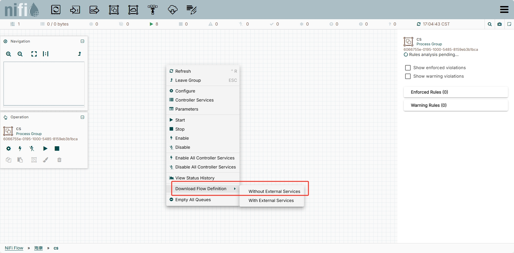
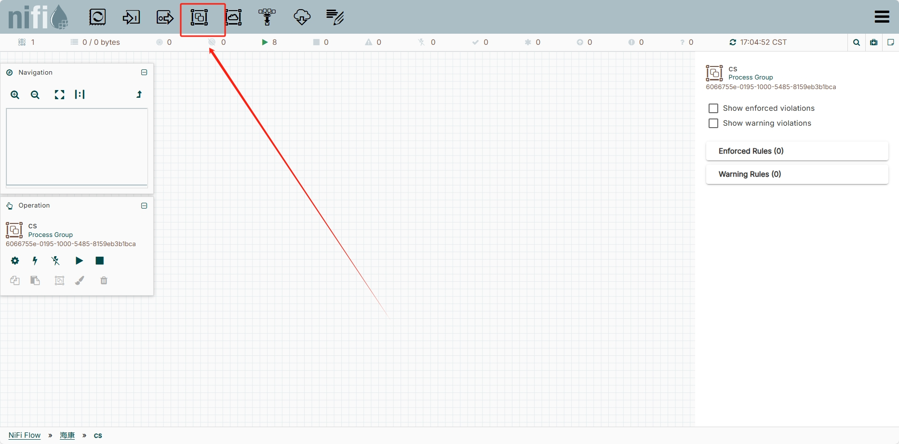
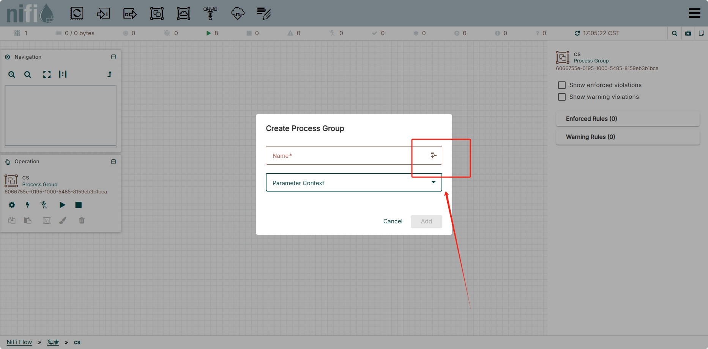
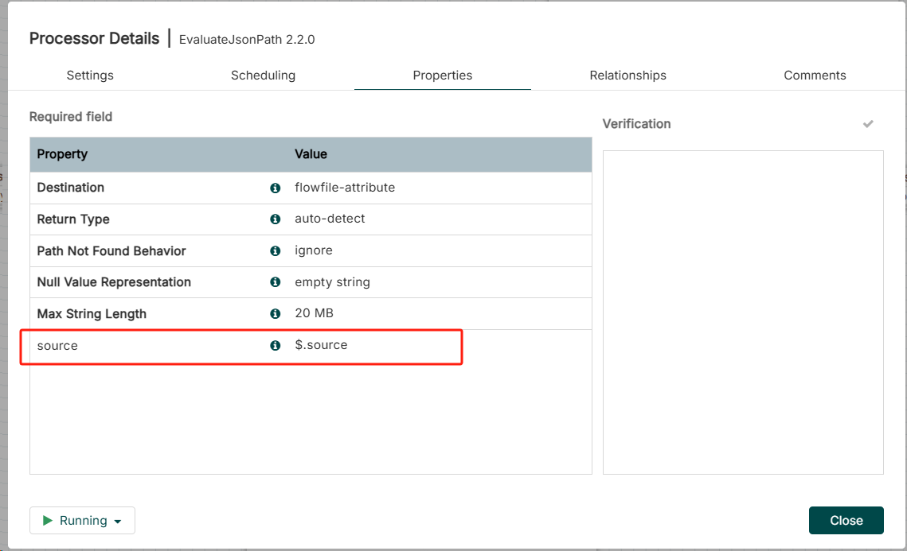
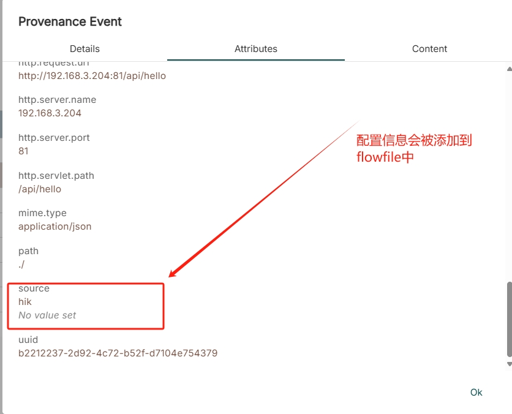

## 安装

* 使用http
> [!caution]
> 先启动后再停止，然后进行修改

> bin/nifi.sh start


修改 nifi.properties 文件

```
nifi.remote.input.secure=false

nifi.web.http.host=10.200.10.21
nifi.web.http.port=7788

nifi.web.https.host=
nifi.web.https.port=


```


## 使用

删除管道需要上下游processor都停止


变量


### 表达式

**[JsonPath expression](https://github.com/json-path/JsonPath)**
**[NiFi Expression](https://nifi.apache.org/nifi-docs/expression-language-guide.html)**


### Processors


#### 数据清洗

SplitJson


### Input Port & Output port


用来连接ProcessGroup


### 导出和导入flow definition






## 说明

Properties ——每个Processor内置的配置
Dynamic Properties ——每个Processor允许用户自定义的属性

### 案例

* EvaluateJsonPath





