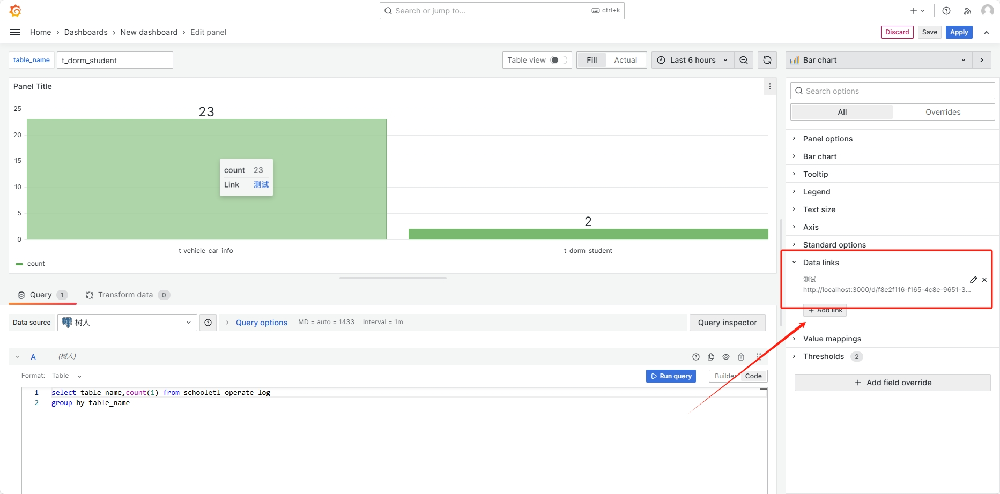
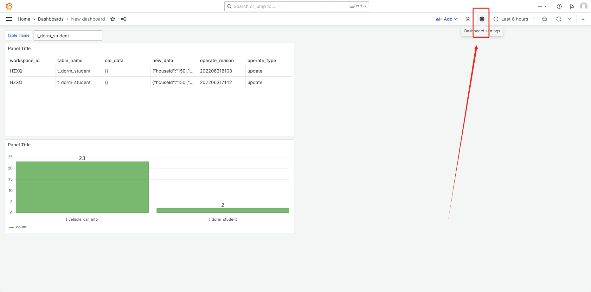
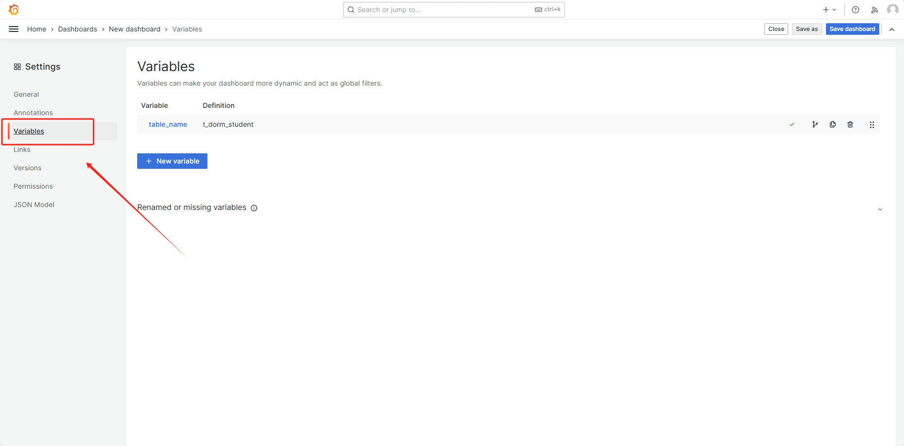
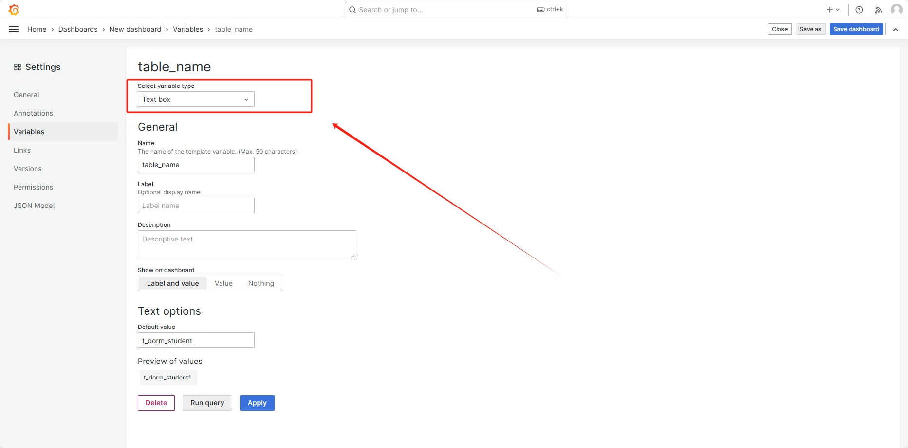
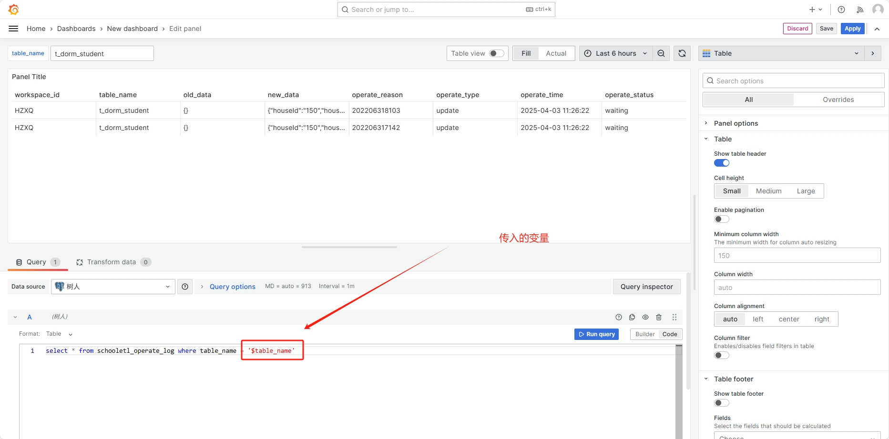
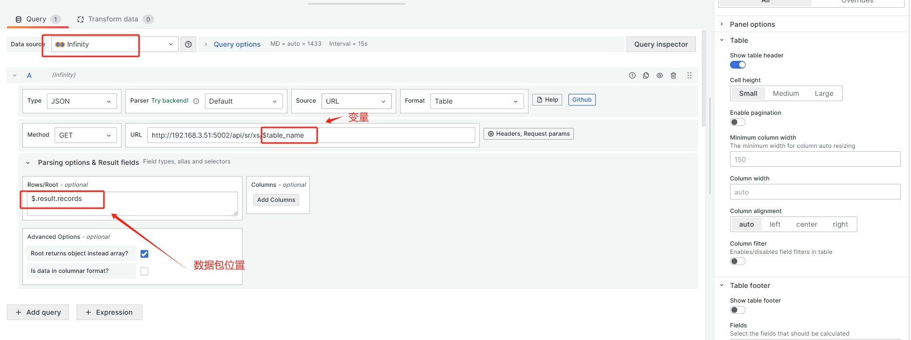

https://grafana.com/grafana/download


https://gitee.com/derek2468/grafana-dashboards

## 服务启动

```
nohup bin/grafana-server &


默认用户/密码： admin/admin
```

## [案例](https://grafana.com/grafana/dashboards/)


with t as (
select 
	table_name, concat(operate_type,'_', operate_status) as t,
	count(1) as num
 from schooletl_operate_log
 group by table_name, operate_type, operate_status
)
select 
	table_name,
	max(case when t = 'append_finish' then num else 0 end) as 新增成功,
	max(case when t = 'append_waiting' then num else 0 end) as 新增等待,
  max(case when t = 'update_finish' then num else 0 end) as 更新成功
from t
group by table_name


## 数据下钻

* 配置跳转链接

http://localhost:3000/d/f8e2f116-f165-4c8e-9651-358a8df1c733/new-dashboard?orgId=1&var-table_name=${__data.fields.table_name}

仪表盘地址：
http://localhost:3000/d/f8e2f116-f165-4c8e-9651-358a8df1c733/new-dashboard?orgId=1


变量名称(定义变量名前加var-)：var-table_name
传入的参数(输入$可进行选择)：${__data.fields.table_name}




* 配置变量





* 配置明细



## 插件

###  api数据源

```
sudo bin/grafana cli plugins install yesoreyeram-infinity-datasource
```
* 解析数据包

