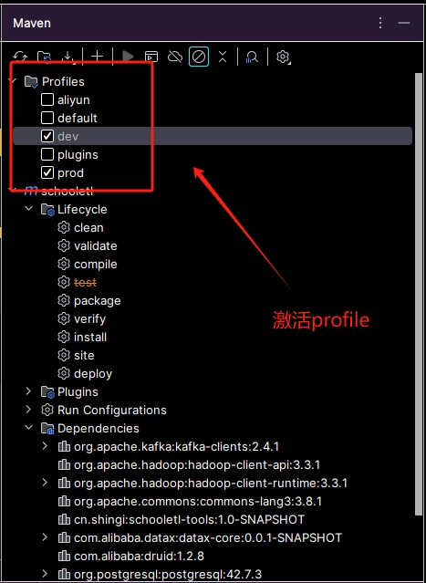
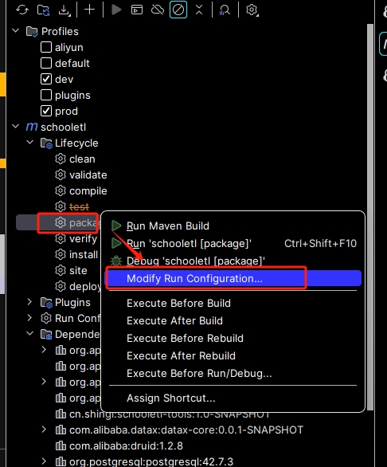
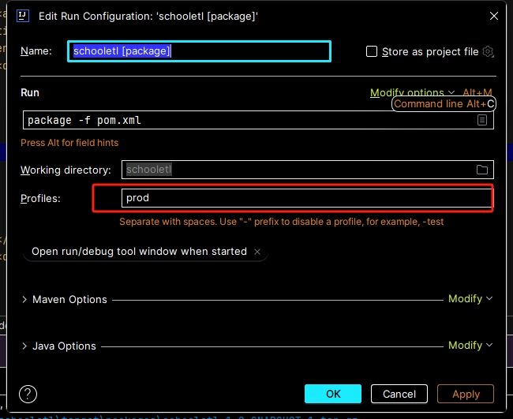

## 排除配置文件

在 pom.xml 中配置资源过滤，确保编译后的 target/classes 不包含 XML

```
 <build>
<resources>
    <resource>
        <directory>./src/main/resources</directory>
        <excludes>
            <exclude>*.xml</exclude>
        </excludes>
    </resource>
</resources>


</build>
```


mvn clean install -T 1C -Dmaven.test.skip=true -Dmaven.compile.fork=true


## 开启多线程编译：

-Dmaven.compile.fork=true

##  每核增加一个线程进行构建：

-T 1C

## 输出依赖
mvn dependency:tree > tree.txt

## Do not recurse into sub-projects
    mvn -N  


## 打包指定依赖

```

    <build>
        <plugins>

<!--            打包scala-->
            <plugin>
                <groupId>net.alchim31.maven</groupId>
                <artifactId>scala-maven-plugin</artifactId>
                <version>3.1.4</version>
                <executions>
                    <execution>
                        <id>scala-compile-first</id>
                        <phase>process-resources</phase>
                        <goals>
                            <goal>add-source</goal>
                            <goal>compile</goal>
                        </goals>
                        <configuration>
                            <addScalacArgs>-target:jvm-1.8</addScalacArgs>
                        </configuration>
                    </execution>
                    <execution>
                        <id>scala-test-compile</id>
                        <phase>process-test-resources</phase>
                        <goals>
                            <goal>testCompile</goal>
                        </goals>
                    </execution>
                </executions>
            </plugin>

            <plugin>
                <groupId>org.apache.maven.plugins</groupId>
                <artifactId>maven-assembly-plugin</artifactId>
                <version>3.3.0</version> <!-- 使用适当的版本号 -->
                <executions>
                    <execution>
                        <id>make-assembly</id>
                        <phase>package</phase>
                        <goals>
                            <goal>single</goal>
                        </goals>
                        <configuration>
                            <descriptors>
                                <descriptor>src/assembly/assembly.xml</descriptor>
                            </descriptors>
                        </configuration>
                    </execution>
                </executions>
            </plugin>
        </plugins>
    </build>
```


```
<assembly xmlns="http://maven.apache.org/ASSEMBLY/2.0.0">
    <id>assembly</id>
    <formats>
        <format>jar</format>
    </formats>
    <includeBaseDirectory>false</includeBaseDirectory>

    <dependencySets>
        <dependencySet>
            <outputDirectory>/</outputDirectory>
            <useProjectArtifact>true</useProjectArtifact>
            <unpack>true</unpack>
            <scope>runtime</scope>
            <includes>
                <include>cn.shingi:*</include>
                <include>com.hikvision.ga:*</include>
            </includes>
        </dependencySet>
    </dependencySets>
</assembly>

```

## 不同的构建环境下使用不同的依赖配置


profile

* 命令行打包
mvn clean package -P prod
* idea 打包




```
<profiles>
        <profile>
            <id>dev</id>
            <activation>
                <activeByDefault>true</activeByDefault>
            </activation>
            <dependencies>
                <dependency>
                    <groupId>org.apache.spark</groupId>
                    <artifactId>spark-sql_2.13</artifactId>
                    <version>${spark.version}</version>
                    <exclusions>
                        <exclusion>
                            <groupId>org.slf4j</groupId>
                            <artifactId>slf4j-api</artifactId>
                        </exclusion>
                    </exclusions>
                </dependency>
                <dependency>
                    <groupId>org.codehaus.janino</groupId>
                    <artifactId>janino</artifactId>
                    <version>3.0.8</version>
                </dependency>
            </dependencies>
        </profile>
        <profile>
            <id>prod</id>
            <dependencies>
                <dependency>
                    <groupId>org.apache.spark</groupId>
                    <artifactId>spark-sql_2.13</artifactId>
                    <version>${spark.version}</version>
                    <scope>provided</scope>
                    <exclusions>
                        <exclusion>
                            <groupId>org.slf4j</groupId>
                            <artifactId>slf4j-api</artifactId>
                        </exclusion>
                    </exclusions>
                </dependency>
                <dependency>
                    <groupId>org.codehaus.janino</groupId>
                    <artifactId>janino</artifactId>
                    <version>3.0.8</version>
                    <scope>provided</scope>
                </dependency>
            </dependencies>
        </profile>
    </profiles>

```