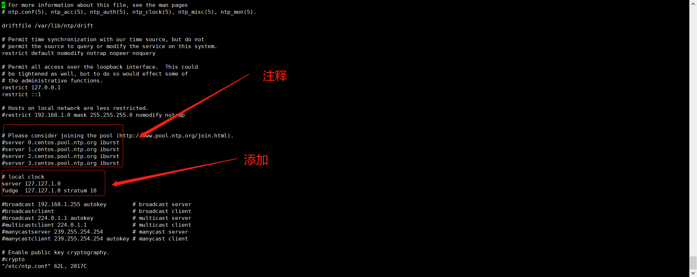
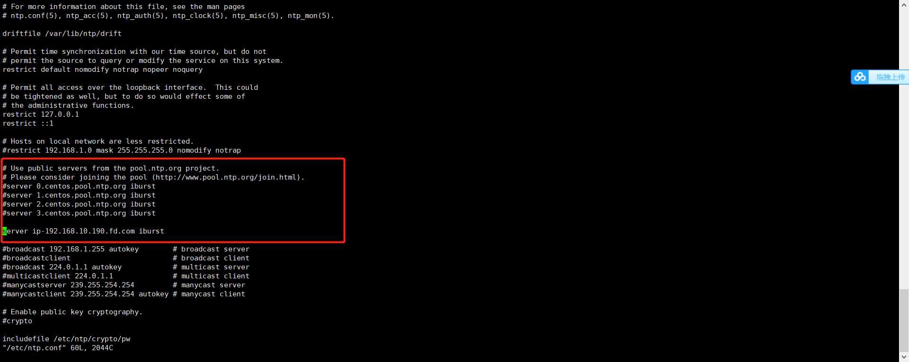

## ssh 私钥登录

```
ssh-keygen -t rsa
cat ~/.ssh/id_rsa.pub >> ~/.ssh/authorized_keys
```


## 常用命令
```
ls -l | more   # 查看文件夹
ls -lt        # 从新到旧排序（最近的排前面）
ls -ltr       # 从旧到新排序（反转顺序）
ls | wc -l # 统计文件数
```


## 添加sudo

> echo "hadoop ALL=(ALL) NOPASSWD: ALL" >> /etc/sudoers

## 重置root密码

LANG=en_US.UTF-8，在后面追加rw single init=/bin/bash,然后按ctrl+x重启系统

passwd


4、如果开启了SELinux，执行命令touch /.autorelabel命令

5、输入exec /sbin/init命令重启系统

6、使用新设置的密码进入系统之后，为了安全起见，可以输入reboot重新启动一次系统。


## 图形化界面

yum -y groups install "GNOME Desktop"
yum -y install xrdp
systemctl start xrdp

使用远程桌面连接


## 快速移动大约40GB的数据
rsync可以在两个目录之间同步数据，并且可以非常高效地处理大文件和大目录

> rsync -avh /source_directory/ /destination_directory/

这个命令会将 /source_directory 中的所有文件和子目录复制到 /destination_directory，并保持文件权限和时间戳。


## 防火墙


::: tabs

@tab Ubuntu

```
ufw status

ufw allow 22

sudo ufw allow from 192.168.1.100

ufw status
```

@tab Centos

### 添加端口

```

firewall-cmd --permanent --add-port=4000/tcp && systemctl restart firewalld
```
### 删除端口

```
firewall-cmd --zone=public --remove-port=443/tcp --permanent \
```

### 添加ip

```
firewall-cmd --permanent --add-rich-rule="rule family="ipv4" source address="server191.bd.jz" accept"
```
### 开放网段

sudo firewall-cmd --permanent --add-source=192.168.3.0/24  && systemctl restart firewalld

:::


## sudo权限

> echo "deploy ALL=(ALL) NOPASSWD: ALL" >> /etc/sudoers


## 服务自启

/usr/lib/systemd/system
systemctl daemon-reload


::: tabs

@tab Nginx

```

[Unit]
Description=The nginx HTTP and reverse proxy server
After=network-online.target remote-fs.target nss-lookup.target
Wants=network-online.target

[Service]
Type=forking
PIDFile=/run/nginx.pid
# Nginx will fail to start if /run/nginx.pid already exists but has the wrong
# SELinux context. This might happen when running `nginx -t` from the cmdline.
# https://bugzilla.redhat.com/show_bug.cgi?id=1268621
ExecStartPre=/usr/bin/rm -f /run/nginx.pid
ExecStartPre=/usr/sbin/nginx -t
ExecStart=/usr/sbin/nginx
ExecReload=/usr/sbin/nginx -s reload
KillSignal=SIGQUIT
TimeoutStopSec=5
KillMode=mixed
PrivateTmp=true

[Install]
WantedBy=multi-user.target
```


@tab Node

```
[Unit]
Description=My Node.js Application
After=mysqld.service 

[Service]
User=root
WorkingDirectory=/home/soft/report/build
ExecStart=/usr/local/bin/npm run start
ExecStop=/usr/local/bin/npm run stop
Restart=always
RestartSec=10
Environment=NODE_ENV=production
RemainAfterExit=yes   # 解决systemctl在service处于inactive状态时会自动调用ExecStop

[Install]
WantedBy=multi-user.target


```


:::


## 磁盘挂载

检查 LVM 的配置和使用情况

lsblk
vgdisplay
lvdisplay

1. 扩展逻辑卷
将所有未分配的 PE 分配给 /dev/ubuntu-vg/ubuntu-lv。你可以使用 lvextend 命令：
bash
复制代码
lvextend -l +100%FREE /dev/ubuntu-vg/ubuntu-lv
这里 -l +100%FREE 表示将所有未分配的空间都分配给逻辑卷。

2. 扩展文件系统
扩展逻辑卷后，还需要扩展文件系统以利用新的空间。假设你使用的是 ext4 文件系统：
bash
复制代码
resize2fs /dev/ubuntu-vg/ubuntu-lv


```
查看可以使用的磁盘
fdisk -l 
fdisk /dev/vdc
n
p
回车
回车
回车
t
8e
w

yum -y install lvm2
pvcreate /dev/vdc
mkfs.xfs -f /dev/vdc
mount /dev/vdc /easyv


blkid /dev/vdb1
vi /etc/fstab
UUID=d6da6281-84a2-4d5c-ab6e-41d17f0d94db /data  xfs defaults 0 0
```


## 查看pid详细信息

Linux在启动一个进程时，系统会在/proc下创建一个以PID命名的文件夹，在该文件夹下会有我们的进程的信息，其中包括一个名为exe的文件即记录了绝对路径，通过ll或ls –l命令即可查看

cwd符号链接的是进程运行目录；

exe符号连接就是执行程序的绝对路径；

cmdline就是程序运行时输入的命令行命令；

environ记录了进程运行时的环境变量；

fd目录下是进程打开或使用的文件的符号连接


## wget
wget http://120.26.77.177:11000/jz2.0/ --recursive --no-parent --http-user=admin --http-passwd=Shingi@2023

--recursive --no-parent 递归下载目录所有

## 进程监控

cesi supervisor 


## cd pushd popd dirs

pushd /home
dirs -p -v

-p 参数可以每行一个目录的形式显示堆栈中的目录列表
-v 参数可以在目录前加上编号
-c 清空目录堆栈

pushd 不加参数 在最近的两个目录之间切换

在多个目录之间切换
pushd +n

popd 


pushd：切换到作为参数的目录，并把原目录和当前目录压入到一个虚拟的堆栈中
                 如果不指定参数，则会回到前一个目录，并把堆栈中最近的两个目录作交换
popd： 弹出堆栈中最近的目录
dirs: 列出当前堆栈中保存的目录列表


## 文件权限
4 -r
2 -w
1 -x

文件类型-用户-其他用户-组


## 添加组

usermod -G groupName userName


## 查看压缩包内容

tar --exclude='*/*/*' -tf packages/grafana-enterprise-10.3.1.linux-amd64.tar.gz


## vi 使用

1,$ 或%   全局替换

## 时间同步

::: tabs

@tab Ubuntu

```
timedatectl status

#设置上海时区
sudo timedatectl set-timezone Asia/Shanghai

```


:::

**主服务器停止了，注意重启后关闭防火墙，其他服务器需要先停止ntpd服务后手动同步一次，后再重启服务**
```
systemctl stop ntpd
ntpdate ip-192.168.10.190.fd.com
systemctl start ntpd
```
systemctl stop ntpd && ntpdate ip-192.168.10.190.fd.com && systemctl start ntpd


在集群的所有服务器上安装ntp服务，用于集群时钟同步
> yum -y install ntp

将ntpd加入系统自启动服务并设置开机启动

* 服务端

    > vim /etc/ntp.conf

    添加
```
# local clock
server 127.127.1.0
fudge  127.127.1.0 stratum 10
```

    注释掉所有的server



* 客户端

    添加
    
        server 服务端地址(ip-192.168.10.190.fd.com) iburst




* 手动同步一次时间

> /usr/sbin/ntpdate ip-192.168.10.190.fd.com

* 重启集群所有节点的ntpd服务

> systemctl restart ntpd

验证时钟同步，在所有节点执行

> ntpq -p

有“*”显示则表示同步成功。**需要等会**


## 配置静态IP

::: tabs
@tab Ubuntu

```
cd /etc/netplan
vi 

network:
  version: 2
  renderer: NetworkManager
  ethernets:
    enp0s5:   # 网卡名称
      dhcp4: no     # 关闭dhcp
      dhcp6: no
      addresses: [10.211.55.10/24]  # 静态ip
      gateway4: 10.211.55.1     # 网关
      nameservers:
        addresses: [8.8.8.8, 114.114.114.114] #dns


sudo netplan apply
```

:::

## 设置hostname

```
hostnamectl --static set-hostname hostname
```


## 添加路由

route add -host 192.168.8.65 gw 10.10.3.254