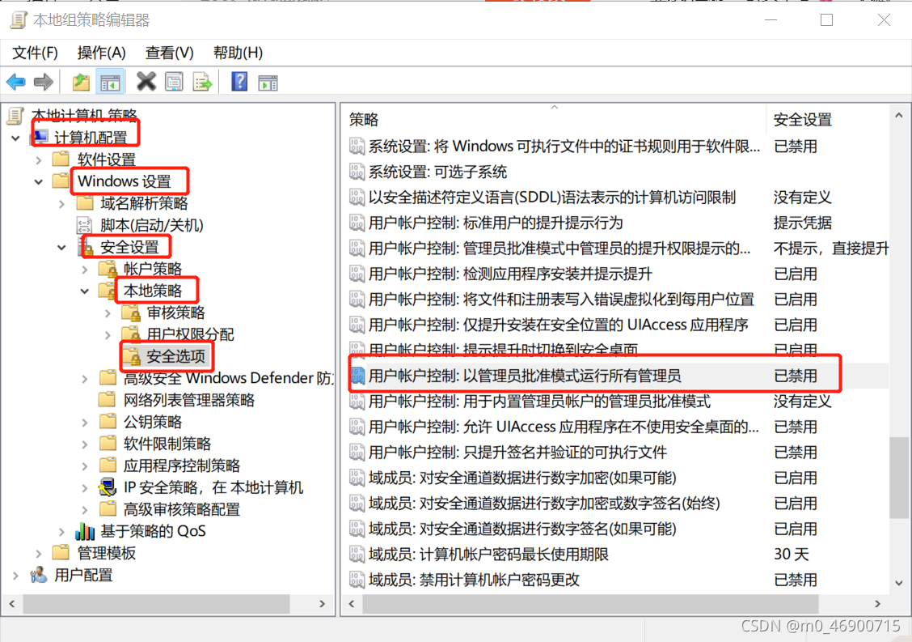

# 普通用户赋管理员权限

保存为ansi格式，以管理员运行
```
@echo off

 

pushd "%~dp0"

 

dir /b C:\Windows\servicing\Packages\Microsoft-Windows-GroupPolicy-ClientExtensions-Package~3*.mum >List.txt

 

dir /b C:\Windows\servicing\Packages\Microsoft-Windows-GroupPolicy-ClientTools-Package~3*.mum >>List.txt

 

for /f %%i in ('findstr /i . List.txt 2^>nul') do dism /online /norestart /add-package:"C:\Windows\servicing\Packages\%%i"

 

pause
```


gpedit.msc

禁用以管理员批准模式运行所有管理员

