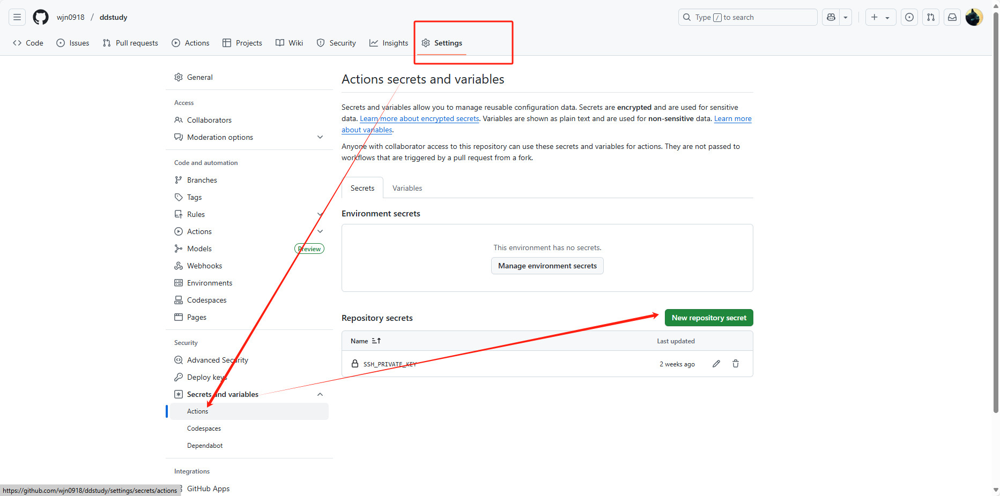

## github action 


### ssh 远程执行

```
  remote-deploy:
    needs: build-and-push
    runs-on: ubuntu-latest

    steps:
      - name: SSH into Server and Deploy
        uses: appleboy/ssh-action@v1.0.0
        with:
          host: ${{ secrets.SERVER_HOST }}
          username: ${{ secrets.SERVER_USER }}
          key: ${{ secrets.SERVER_SSH_KEY }}
          script: |
            docker pull registry.cn-hangzhou.aliyuncs.com/wjn0918/soft:easybd-frontend
            docker pull registry.cn-hangzhou.aliyuncs.com/wjn0918/soft:easybd-backend
            docker compose -f /opt/easybd/compose.yml down
            docker compose -f /opt/easybd/compose.yml up -d
```

SERVER_SSH_KEY 使用~/.ssh/id_rsa

