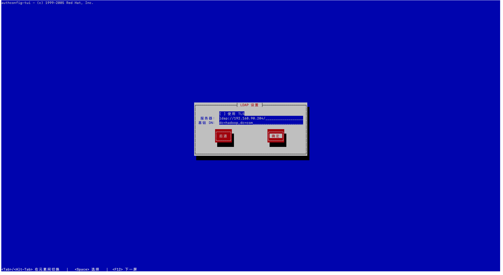

# 服务端

```shell

# 安装
yum install openldap openldap-servers openldap-clients openldap-devel compat-openldap -y


# 生成LADP数据库配置
cp /usr/share/openldap-servers/DB_CONFIG.example /var/lib/ldap/DB_CONFIG
chown -R ldap:ldap /var/lib/ldap
yum install krb5-server-ldap -y 
# 拷贝kerberos schema
cp /usr/share/doc/krb5-server-ldap-1.15.1/kerberos.schema /etc/openldap/schema/


# 生成slapd配置文件
cat >> /etc/openldap/slapd.conf << EOF
include /etc/openldap/schema/corba.schema
include /etc/openldap/schema/core.schema
include /etc/openldap/schema/cosine.schema
include /etc/openldap/schema/duaconf.schema
include /etc/openldap/schema/dyngroup.schema
include /etc/openldap/schema/inetorgperson.schema
include /etc/openldap/schema/java.schema
include /etc/openldap/schema/kerberos.schema
include /etc/openldap/schema/misc.schema
include /etc/openldap/schema/nis.schema
include /etc/openldap/schema/openldap.schema
include /etc/openldap/schema/pmi.schema
include /etc/openldap/schema/ppolicy.schema
pidfile /var/run/openldap/slapd.pid
argsfile /var/run/openldap/slapd.args
EOF

#测试配置正确性与否
slaptest -f /etc/openldap/slapd.conf -F /etc/openldap/slapd.d

chown -R ldap:ldap /etc/openldap/slapd.d && chmod -R 700 /etc/openldap/slapd.d

rm -f /etc/openldap/slapd.d/cn\=config/cn\=schema/cn\=\{1\}core.ldif
rpm -e cyrus-sasl-sql
rpm -e cyrus-sasl-ldap
# 启动
systemctl start slapd
# 设置开机启动
systemctl enable slapd
# 最后查看不报错即可
systemctl status slapd


```

## 修改数据库配置


```shell
cd /etc/openldap/schema/ 
# 生成管理员密码并填入change.ldif olcRootPW的配置 (root就是密码),
# 格式为：{SSHA}cuuZfYLFzXcwKbwAxHf5XnJQ4YAdkP0B
slappasswd -s root
{SSHA}3T0BylPGNmX3NqC1J0Z2bcRXqTCpTCTk


# 新建文件，填入以下内容，注意格式
#change.ldif内容，修改第14行，设置olcRootPW为上一步生成的密码：
vim change.ldif

dn: olcDatabase={2}hdb,cn=config
changetype: modify
replace: olcSuffix
olcSuffix: dc=hadoop,dc=com

dn: olcDatabase={2}hdb,cn=config
changetype: modify
replace: olcRootDN
olcRootDN: uid=ldapadmin,ou=people,dc=hadoop,dc=com

dn: olcDatabase={2}hdb,cn=config
changetype: modify
add: olcRootPW
olcRootPW: {SSHA}3T0BylPGNmX3NqC1J0Z2bcRXqTCpTCTk

dn: olcDatabase={2}hdb,cn=config
changetype: modify
add: olcAccess
olcAccess: {0}to dn.base="" by * read
olcAccess: {1}to * by dn="uid=ldapadmin,ou=people,dc=hadoop,dc=com" write by * read

dn: cn=config
changetype: modify
add: olcAuthzRegexp
olcAuthzRegexp: uid=([^,]*),cn=GSSAPI,cn=auth uid=$1,ou=people,dc=hadoop,dc=com
```

初始化并验证结果：

```shell

ldapmodify -c -Y EXTERNAL -H ldapi:/// -f change.ldif


ldapmodify -c -Y EXTERNAL -H ldapi:/// -f change.ldif 是一个使用LDAP协议通过ldapi连接到本地LDAP服务器，并使用change.ldif文件中的LDIF（LDAP Data Interchange Format）内容进行修改操作的命令。

该命令使用了以下参数：

-c：表示连续模式，即在遇到错误时继续进行修改而不中止。
-Y EXTERNAL：表示使用外部身份验证，该参数指示使用主机操作系统的外部机制进行身份验证。
-H ldapi:///：表示使用LDAP的本地套接字接口（ldapi）连接到本地LDAP服务器。
-f change.ldif：表示从change.ldif文件中读取LDIF内容，包含了要执行的修改操作。
通过该命令，你可以将change.ldif文件中的LDIF内容应用于本地LDAP服务器，实现对LDAP目录的修改。change.ldif文件中应包含正确格式的LDIF修改语句，如添加（add）、删除（delete）、修改（modify）等，以及相应的目录项和属性值。


# 结果2：生成相应的数据库
[root@server204 ~]# ll /etc/openldap/slapd.d/cn\=config
总用量 20
drwx------ 2 ldap ldap 336 3月  27 09:15 cn=schema
-rwx------ 1 ldap ldap 378 3月  27 09:12 cn=schema.ldif
-rwx------ 1 ldap ldap 513 3月  27 09:12 olcDatabase={0}config.ldif
-rwx------ 1 ldap ldap 443 3月  27 09:12 olcDatabase={-1}frontend.ldif
-rwx------ 1 ldap ldap 562 3月  27 09:12 olcDatabase={1}monitor.ldif
-rw------- 1 ldap ldap 851 3月  28 17:49 olcDatabase={2}hdb.ldif
```


# 添加ldapadmin

#编辑ldapadmin用户配置


vim ldapadmin.ldif


dn: dc=hadoop,dc=com
objectClass: top
objectClass: dcObject
objectclass: organization
o: hadoop com
dc: hadoop

dn: ou=people,dc=hadoop,dc=com
objectclass: organizationalUnit
ou: people
description: Users

dn: ou=group,dc=hadoop,dc=com
objectClass: organizationalUnit
ou: group

dn: uid=ldapadmin,ou=people,dc=hadoop,dc=com
objectClass: inetOrgPerson
objectClass: posixAccount
objectClass: shadowAccount
cn: LDAP admin account
uid: ldapadmin
sn: ldapadmin
uidNumber: 1111
gidNumber: 1111
homeDirectory: /home/ldapadmin
loginShell: /bin/bash

#添加用户
ldapadd -c -x -D "uid=ldapadmin,ou=people,dc=hadoop,dc=com" -w root -f ldapadmin.ldif


# 客户端


```shell
# 安装openldap客户端
yum -y install openldap-clients nss-pam-ldapd
# 配置认证⽅式
authconfig-tui
```




```
#检查base和url配置项
cat /etc/openldap/ldap.conf
#
# LDAP Defaults
#

# See ldap.conf(5) for details
# This file should be world readable but not world writable.

URI ldap://192.168.90.112/
BASE dc=hadoop,dc=com

#SIZELIMIT      12
#TIMELIMIT      15
#DEREF          never

TLS_CACERTDIR /etc/openldap/cacerts

# Turning this off breaks GSSAPI used with krb5 when rdns = false
SASL_NOCANON    on
```

```
#验证客户端是否有效
id ldapadmin
```


### 3. LDAP集成Kerberos

目的实现身份验证(kerberos)和访问控制(ldap)

#### 3.1 创建ldapa管理员凭据

```shell
# 创建管理员principal 密码: admin
kadmin.local -q "addprinc ldapadmin@HADOOP.COM"

# 创建ldap账号，修改成对应的主机名
kadmin.local -q "addprinc -randkey ldap/server158.bigdata.local@HADOOP.COM"
kadmin.local -q "ktadd -k /etc/openldap/ldap.keytab ldap/server158.bigdata.local@HADOOP.COM"
chown ldap:ldap /etc/openldap/ldap.keytab && chmod 640 /etc/openldap/ldap.keytab
```


#### 3.2 修改slapd配置并重启

```shell
#修改KRB5_KTNAME为/etc/openldap/ldap.keytab并重启slapd
cat /etc/sysconfig/slapd
# OpenLDAP server configuration
# see 'man slapd' for additional information

# Where the server will run (-h option)
# - ldapi:/// is required for on-the-fly configuration using client tools
#   (use SASL with EXTERNAL mechanism for authentication)
# - default: ldapi:/// ldap:///
# - example: ldapi:/// ldap://127.0.0.1/ ldap://10.0.0.1:1389/ ldaps:///
SLAPD_URLS="ldapi:/// ldap:///"

# Any custom options
#SLAPD_OPTIONS=""

# Keytab location for GSSAPI Kerberos authentication
KRB5_KTNAME="FILE:/etc/openldap/ldap.keytab"


systemctl restart slapd
```


#### 3.6 导入linux系统用户

```shell
#安装migrationtools工具
yum install migrationtools -y
# 修改模板设置
vim /usr/share/migrationtools/migrate_common.ph
DEFAULT_MAIL_DOMAIN = "HADOOP.COM";
DEFAULT_BASE = "dc=hadoop,dc=com";

#导入linux用户到ldap
/usr/share/migrationtools/migrate_base.pl > base.ldif
# 修改base.ldif 删除已导⼊ 项⽬ Group People hadoop ,导⼊
ldapadd -x -D "uid=ldapadmin,ou=people,dc=hadoop,dc=com" -w root -f base.ldif
# 导⼊deploy⽤户
grep -E "deploy" /etc/passwd > deploy-passwd.txt
/usr/share/migrationtools/migrate_passwd.pl deploy-passwd.txt deploy-passwd.ldif
ldapadd -x -D "uid=ldapadmin,ou=people,dc=hadoop,dc=com" -w root -f deploy-passwd.ldif
grep -E "deploy" /etc/group > deploy-group.txt
/usr/share/migrationtools/migrate_group.pl deploy-group.txt deploy-group.ldif
ldapadd -x -D "uid=ldapadmin,ou=people,dc=hadoop,dc=com" -w root -f deploy-group.ldif
```


#### 3.7 导入集群服务用户

```shell
#添加用户（hdfs/hive/yarn/hue等等）
grep -E "hdfs" /etc/passwd > hdfs.txt
/usr/share/migrationtools/migrate_passwd.pl hdfs.txt hdfs.ldif
# 添加ldap用户
ldapadd -c -x -D "uid=ldapadmin,ou=people,dc=hadoop,dc=com" -w root -f hdfs.ldif
# 修改ldap密码
ldappasswd -x -D 'uid=ldapadmin,ou=people,dc=hadoop,dc=com' -w root "uid=hdfs,ou=people,dc=hadoop,dc=com" -s hdfs

#添加用户组
//导⼊组hdfs
grep -E "hdfs" /etc/group > hdfs_grp.txt
/usr/share/migrationtools/migrate_group.pl hdfs_grp.txt hdfs_grp.ldif
ldapadd -x -D "uid=ldapadmin,ou=people,dc=hadoop,dc=com" -w root -f hdfs_grp.ldif
```

**其他用户**

```shell
grep -E "hive" /etc/passwd > hive.txt
/usr/share/migrationtools/migrate_passwd.pl hive.txt hive.ldif
ldapadd -c -x -D "uid=ldapadmin,ou=people,dc=hadoop,dc=com" -w root -f hive.ldif
ldappasswd -x -D 'uid=ldapadmin,ou=people,dc=hadoop,dc=com' -w root "uid=hive,ou=people,dc=hadoop,dc=com" -s hive@1298


grep -E "hive" /etc/group > hive_grp.txt
/usr/share/migrationtools/migrate_group.pl hive_grp.txt hive_grp.ldif
ldapadd -x -D "uid=ldapadmin,ou=people,dc=hadoop,dc=com" -w root -f hive_grp.ldif

------------------------------------------------------------------------------------


grep -E "yarn" /etc/passwd > yarn.txt
/usr/share/migrationtools/migrate_passwd.pl yarn.txt yarn.ldif
ldapadd -c -x -D "uid=ldapadmin,ou=people,dc=hadoop,dc=com" -w root -f yarn.ldif
ldappasswd -x -D 'uid=ldapadmin,ou=people,dc=hadoop,dc=com' -w root "uid=yarn,ou=people,dc=hadoop,dc=com" -s yarn


grep -E "yarn" /etc/group > yarn_grp.txt
/usr/share/migrationtools/migrate_group.pl yarn_grp.txt yarn_grp.ldif
ldapadd -x -D "uid=ldapadmin,ou=people,dc=hadoop,dc=com" -w root -f yarn_grp.ldif

------------------------------------------------------------------------------------
grep -E "hue" /etc/passwd > hue.txt
/usr/share/migrationtools/migrate_passwd.pl hue.txt hue.ldif
ldapadd -c -x -D "uid=ldapadmin,ou=people,dc=hadoop,dc=com" -w root -f hue.ldif
ldappasswd -x -D 'uid=ldapadmin,ou=people,dc=hadoop,dc=com' -w root "uid=hue,ou=people,dc=hadoop,dc=com" -s hue@1298


grep -E "hue" /etc/group > hue_grp.txt
/usr/share/migrationtools/migrate_group.pl hue_grp.txt hue_grp.ldif
ldapadd -x -D "uid=ldapadmin,ou=people,dc=hadoop,dc=com" -w root -f hue_grp.ldif
```


#### 3.7 安装ldap客户端（所有节点）

```shell
# 所有节点安装openldap客户端
for i in `cat /data/tools/cdh-6.3.2/soft/install/ip.list`;do ssh $i "yum -y install openldap-clients nss-pam-ldapd";echo --------$i----------;done
# 配置认证⽅式
authconfig-tui
```


```shell
#检查base和url配置项
cat /etc/openldap/ldap.conf
#
# LDAP Defaults
#

# See ldap.conf(5) for details
# This file should be world readable but not world writable.

URI ldap://192.168.90.112/
BASE dc=hadoop,dc=com

#SIZELIMIT      12
#TIMELIMIT      15
#DEREF          never

TLS_CACERTDIR /etc/openldap/cacerts

# Turning this off breaks GSSAPI used with krb5 when rdns = false
SASL_NOCANON    on


#验证客户端是否有效
id ldapadmin
```
