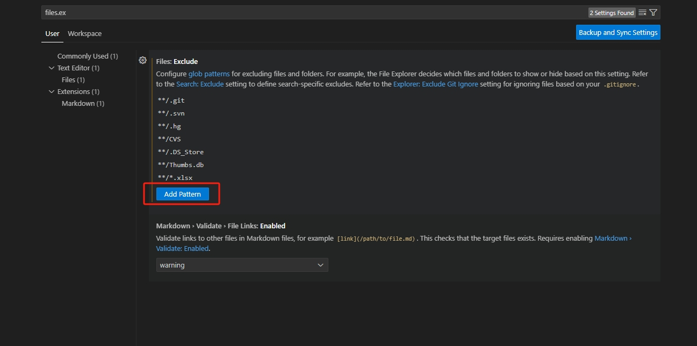

## 在VSCode中设置隐藏文件
    1、 文件-》首选项-》设置 打开setting
    2、 搜索files.exclude，选择工作区设置（PS:如果想全局设置，选择用户设置）
    3、 添加模式：**/*.spec.ts

## 快捷操作

* 快速创建文件

ctrl + N  
ctrl + s   

* 输出到“调试控制台”而不是“终端”

launch.json  配置  "console": "internalConsole"

## LANGUAGES

### GO

https://code.visualstudio.com/docs/languages/go